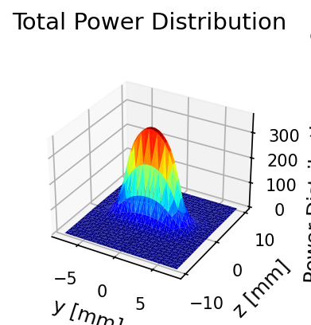
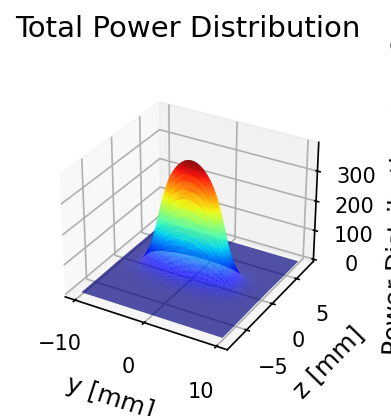
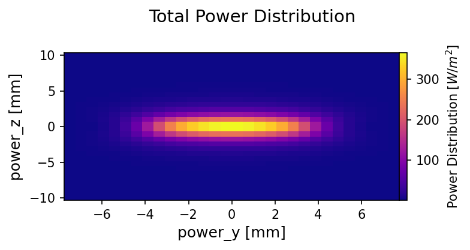

++++++++++++++++
Quickguide
++++++++++++++++

WAVE
================

General Things
-------------------------------

The Coordinate System
^^^^^^^^^^^^^^^^^^^^^^^^^^^^^^

The x coordinate is in longitudinal direction, i.e. along the beam. The y-direction is vertical and z is horizontal. 

First Run
-------------------------------

First you have to tell python where unduwave is located. For this we do:

.. code-block:: python

   import sys
   import os
   sys.path.insert(0, 'absolute/path/to/unduwave/')

| This is a hack and will be soon changed by making the package installable. (It actually already is installable, but I did not test it and it may be buggy if used in this way)

To import unduwave, do:

.. code-block:: python

   import unduwave as uw
   
To run a simple simulation:

.. code-block:: python
   :linenos:
   
   wave = uw.wave(undu_mode='undu_easy')
   wave_prog_paras = wave._wave_prog_paras 
   wave_prog_paras.res_folder.set('res/') 
   wave_prog_paras.spec_calc.set(0)
   wave.run()

| The first line creates a wave object which is used to control the parameter setting, the simulation and the creation of results. The parameter undu_mode determines what the undulator model is that is used in the background. "undu_easy" means a simple undulator model is used.

| The second line gives you the general program parameter object. Changing the elements of this class will change the corresponding parameter. The third line gives an example of that, changing the "res_folder" element of the wave program paramters.

| The fourth line sets the parameter "spec_calc" to 0, thereby switching off spectrum calculations. Only the magnetic fields and trajectories are generated.

| Line 5 runs the wave simulation.

| Congratulations, you just ran your first WAVE simulation in 5 lines of code.

The Parameter Structures
-------------------------------

| There are a couple of parameter structures that allow to control the program flow. These are _ebeam_parameters, _screen_parameters, _spectrometer_paras, _undu_paras and _wave_prog_parameters. These are accessible vie the wave-object returned by a "unduwave.wave()" call and can be changed via the set-method as seen in the example above.

The following tables show their contents.

.. table:: _ebeam_parameters
   :widths: auto

   ===============  ==============================  ===============  
     Parameter       Description  (Vals)                     Unit
   ===============  ==============================  =============== 
   beam_en            Beam Energy                     GeV
   current            Beam Current                    A
   bsigz            horizontal beam size              m
   bsigzp            horizontal beam divergence       rad
   bsigy            vertical beam size                m
   bsigyp           vertical beam divergence          rad
   espread          Energy Spread                     %
   emitt_h          Horizontal Emittance              m rad
   emitt_v          Vertical Emittance                m rad
   betfunh          Horizontal Beta Function          m
   betfunv          Vertical Beta Function            m
   circumference    Ring Circumference                m
   rdipol           Bending Radius of Dipoles         m
   ===============  ==============================  ===============

.. table:: _screen_parameters
   :widths: auto

   ===============  ==============================  ===============  
     Parameter       Description  (Vals)                     Unit
   ===============  ==============================  =============== 
   pinh_w            Pinhole Width(z)                     mm
   pinh_h            Pinhole Height(y)                     mm
   pinh_x            Pinhole Position x                    m
   pinh_nz           Number of horiz. Segments                  -
   pinh_ny           Number of vert. Segments                  -
   ===============  ==============================  ===============

.. table:: _spectrometer_paras
   :widths: auto

   ===============  ==============================  ===============  
     Parameter       Description (Vals)                    Unit
   ===============  ==============================  =============== 
   freq_low            Lowest Photon Energy              eV
   freq_high           Highest Photon Energy             eV
   freq_num            Number of energies                -
   undu                Undulator Mode (0/1)                 -
   wigg                Wiggler Mode   (0/1)                 -
   ===============  ==============================  ===============

The undulator mode means the electron is tracked through one period of the device and the radiation on the screen is calculated. The radiation from the other periods is added coherently.

Wiggler mode means the source points on the trajectory are identified and only the radiation from those is considered and added up incoherently. 

If both modes are off, the expert mode is switched on. The whole trajectory is tracked and the radiation added together with appropriate phase-shifts between different points on the trajectory.

.. table:: _undu_paras
   :widths: auto

   ===============  ==============================  ===============  
     Parameter       Description (Vals)                    Unit
   ===============  ==============================  =============== 
   pkHalbasy          K-Value                          -
   b0Halbasy          B-Amplitude                      T
   xlHalbasy          Period Length                    m
   ahwpolHalbasy     Number of Poles (2*periods+1)           -
   b0y               B-Amplt. vert.                    T
   b0z               B-Amplt. hor.                     T
   nper              Num. Periods                      -
   perl_x            Period length                     m
   ell_shift         Shift                             %
   ===============  ==============================  ===============

Different parameters for setting simple undulator models. The first 4 are used in conjunction with "undu_mode='undu_endp'". The other 5 with "undu_mode='undu_ellip'".

.. table:: _wave_prog_parameters
   :widths: auto

   =======================  ==================================    ===============  
     Parameter                  Description (Vals)                    Unit
   =======================  ==================================    =============== 
   wave_prog_folder         Folder where WAVE lies                   -
   in_file_folder           Folder with WAVE in-files                -
   in_files                 Name of wave-in file                     -
   field_folder             Folder where field files lie             -
   field_files              List of magnetic field files             -
   res_folder               Main result folder                       -
   wave_data_res_folder     Subfolder with WAVE-res-data             -
   pics_folder              Subfolder holding result pics            -
   no_copy                  List of wave-results to not copy         -
   wave_ending_extract      File endings to move                     -
   wave_ending_copy         File endings to copy                     -
   wave_files_essentials    Essential files to move                  -
   nthreads                 Number of CPUs to use                    -
   wave_res_copy_behaviour  Copy behaviour                           -
   iefold                   Fold spectrum (energy spread)            -
   spec_calc                Switch on/off spectrum calculation       -
   undu_mode                Undu mode                                -
   =======================  ==================================    ===============

Undu Modes
-------------------------------

The different modes in which unduwave can be used are described. When creating a wave object via:

.. code-block:: python
   :linenos:
   
   wave = uw.wave(undu_mode=...)
   
| You can specify the mode in which you want to use wave. The mode tells wave basically where you want to get your magnetic field from. The following options are available at the moment: "By", "Byz", "undu_ellip" and "undu_endp". 

| The first two modes mean that you specify the magnetic field via files. The "undu_ellip" mode represents a simple elliptical undulator and "undu_endp" means a simple undulator with endpoles - in these modes the magnetic field is created analytically according to the set options. See the following examples on how to specify the parameters for these use-cases.

User-defined B-Fields
-------------------------------

.. code-block:: python
   :linenos:
   
   import sys
   import os
   sys.path.insert(0, 'absolute/path/to/unduwave/')
   import unduwave as uw

   wave = uw.wave(undu_mode='By')
   wave_prog_paras = wave._wave_prog_paras
   wave_prog_paras.field_files.set( [ 'field.dat' ] )# The magnetic field files to be used in the simulation
   field_folder=''
   wave_prog_paras.field_folder.set(field_folder)# Field Folder

   wave.run()

|The wave object is first organized and from it the program parameters. Then the field file is specified and the folder it lies in. Then the simulation is run. The field file format is two columns separated by whitespaces. The first holding the x-position in mm and the second the magnetic induction in T.

To load a By and Bz field,

.. code-block:: python
   :linenos:
   
   import sys
   import os
   sys.path.insert(0, 'absolute/path/to/unduwave/')
   import unduwave as uw

   wave = uw.wave(undu_mode='Byz')
   wave_prog_paras = wave._wave_prog_paras
   wave_prog_paras.field_files.set( [ 'by_tmp.dat','bz_tmp.dat' ] ) # First file y-second z-component of B
   field_folder=''
   wave_prog_paras.field_folder.set(field_folder)# Field Folder

   wave.run()

This specifies two field files, one for the vertical and one for the horizontal components.

Elliptical Undulator
-------------------------------

.. code-block:: python
   :linenos:
   
   import sys
   import os
   sys.path.insert(0, 'absolute/path/to/unduwave/')
   import unduwave as uw

   wave = uw.wave(undu_mode='undu_ellip')
   undu_paras = wave._undu_paras # getting parameter object
   undu_paras.b0y.set(1.18)
   undu_paras.b0z.set(0.0)
   undu_paras.nper.set(10)
   undu_paras.perl_x.set(0.020)
   undu_paras.ell_shift.set(0.5)
   wave.run()

An elliptical undulator is created. The parameters are set - b0y and b0z - the vertical and horizontal B-amplitude. nper - the number of periods, perl_x - the period length and ell_shift the shift of the elliptical undulator in % of the period-length.
   
Simple Undulator with Endpoles
----------------------------------

.. code-block:: python
   :linenos:
   
   import sys
   import os
   sys.path.insert(0, 'absolute/path/to/unduwave/')
   import unduwave as uw

   wave = uw.wave(undu_mode='undu_endp') # Simple undulator model with endpoles
   undu_paras = wave._undu_paras # getting parameter object
   undu_paras.b0Halbasy.set(1.2)
   nperiods = 3
   undu_paras.ahwpolHalbasy.set(2*nperiods+1) # we count the number of B-field peaks here - one extra for the end-fields (odd)
   undu_paras.xlHalbasy.set(0.02)   
   
A simple undulator model with endpoles is created. We set the B-field amplitude b0Halbasy, the period-length xlHalbasy and the number of main poles. Given the number of periods, the number of poles is 2*n+1. 

Plotting and Results
-------------------------------

Getting Results
^^^^^^^^^^^^^^^^^^^^^^^^^^^^^^^^

After a succesful simulation, get the results by doing:

.. code-block:: python
   
   results = wave.get_results() # Return Result Object

From the results object we can get the quantities wich were calculated. These include: 

.. code-block:: python
   
   quant = results.get_result(which=string_identifier)
   
Where string_identifier can be one of: 

| traj_x, traj_y, traj_z - The x,y,z values of the trajectory.

| By, Bz - y and z components of B

| power_y, power_z, power_distribution - The y and z coordinates for the power distribution on the screen and the values of the actual power distribution

| en_flux, flux - the energy values at which the flux through the pinhole was calculated and the flux itself

| en_brill, brill0, brill0e, brill0f, brill0ef - The energy values at which the Brilliance was calculated and the brilliance. brill0 - no energy spread and no emittance, brill0e - brilliance with energy spread, brill0f - brilliance with emittance folding, brill0ef - brilliance with energy spread and emittance.

| en_fd, flux_density - Energy at which flux density on axis is calculated and flux density on axis

| fd_y, fd_z, flux_density_distribution_{en} - the y and z coordinates of a given flux-density distribution (they are the same for all energies, so one pair suffices) and the actual flux density distribution - which contains the energy rounded to second decimal place. So, for example, at the energy 460 eV, the name would be: flux_density_distribution_460.00

Plotting 2D Results
^^^^^^^^^^^^^^^^^^^^^^^^^^^^^^^^

Each quantities data is saved under quantity._data. Each quantity has a number of plotting routines. To do a simple 2D plot, you can do:

.. code-block:: python
   :linenos:
   
   results = wave.get_results() # Return Result Object
   traj_x = results.get_result(which='traj_x')
   By = results.get_result(which='By')
   By.plot_over(x_quant=traj_x)

This plots the y-component of the B-field over the x-coordinate. 

Merge Plots
^^^^^^^^^^^^^^^^^^^^^^^^^^^^^^^^^^^

To plot y and z components together, do:

.. code-block:: python
   :linenos:
   
   nfig=0 # telling it to start with figure number 0
   results = wave.get_results() # Return Result Object
   traj_x = results.get_result(which='traj_x')
   By = results.get_result(which='By')
   By.plot_over(x_quant=traj_x,nfig=nfig,nosave=True)
   Bz = results.get_result(which='Bz')
   nfig=Bz.plot_over(x_quant=traj_x,nfig=nfig,title='B-Field')
   
This will plot By and Bz into the same window, setting a title and returning the new nfig number which can be used in the next plotting command as an argument.

Log Plots
^^^^^^^^^^^^^^^^^^^^^^^^^^^^^^^^^^^

To plot logarithmic axes, do:

.. code-block:: python
   :linenos:
   
   nfig=0 # telling it to start with figure number 0
   results = wave.get_results() # Return Result Object
   en_flux = results.get_result(which='en_flux')
   flux = results.get_result(which='flux')
   nfig=flux.plot_over(x_quant=en_flux,file_name=None,nosave=False,nfig=nfig,loglog=True)   

Parametric Plots
^^^^^^^^^^^^^^^^^^^^^^^^^^^^^^^^^^^

To do parametric plots, do:

.. code-block:: python
   :linenos:
   
   nfig=0 # telling it to start with figure number 0
   results = wave.get_results() # Return Result Object
   traj_x = results.get_result(which='traj_x')
   traj_y = results.get_result(which='traj_y')
   traj_z = results.get_result(which='traj_z')

   traj_y.plot_over(x_quant=traj_x,nfig=nfig,nosave=True)
   nfig=traj_z.plot_over(x_quant=traj_x,nfig=nfig,title='Trajectory')
   nfig=traj_z.plot_parametric_3d(x_quant=traj_x,y_quant=traj_y,title='Trajectory',nfig=nfig)

3D Plots
^^^^^^^^^^^^^^^^^^^^^^^^^^^^^^^^^^^

To do 3D plots, do:

.. code-block:: python
   :linenos:
   
   nfig=0 # telling it to start with figure number 0
   results = wave.get_results() # Return Result Object
   power_z = results.get_result(which='power_z')
   power_y = results.get_result(which='power_y')
   power_distro = results.get_result(which='power_distribution')
   nfig=power_distro.plot_over_3d(x_quant=power_y,y_quant=power_z,file_name=None,nosave=False,nfig=nfig)

Each call to plot_over_3d creates a 3D plot, a heat plot and plots of interpolated data. 

| Here are some plotting examples:

   Original 3D-plot of a power distribution.

   Interpolated 3D-plot of the previous power distribution.

   Original heat map of the above power distribution.

.. figure:: pics/heat_plot_interp.png
   :scale: 50 %
   :alt: map to buried treasure

   Interpolated heat map of the above power distribution.

Plot Flux Density Distributions
^^^^^^^^^^^^^^^^^^^^^^^^^^^^^^^^^^^

To plot the flux density distribution, you have to specify the energy at which you want to do this. 

.. code-block:: python
   :linenos:
   
   nfig=0 # telling it to start with figure number 0
   results = wave.get_results() # Return Result Object
   flux_dens_distr_ens_loaded = results.find_load_flux_density_distribution(energies=[460,504])
   for en in flux_dens_distr_ens_loaded :
   	fd = results.get_result(which=f'flux_density_distribution_{en:.2f}')
   	nfig=fd.plot_over_3d(x_quant=fd_y,y_quant=fd_z,file_name=None,nosave=False,nfig=nfig)

The call to find_load_flux_density_distribution searches for the closest distribution files to the energies specified and returns the corresponding energies it found as a list. From this returned list, the corresponding flux_densitie quantities can be returned and then plotted.

Undumag
================

