++++++++++++++++
Quickguide
++++++++++++++++

The Wave Module
================

This module is used for the calculation of properties of the emitted radiation by electrons traversing magnetic fields.

First Run
-------------------------------

To import unduwave, do:

.. _codeblockA:

.. code-block:: python

   import unduwave as uw
   from pathlib import Path
   
To run a simple wave simulation:

.. _codeblockB:

.. code-block:: python
   :linenos:
   
   wave = uw.wave(undu_mode='undu_easy')
   wave_prog_paras = wave._wave_prog_paras 
   wave_prog_paras.res_folder.set(Path("/full/path/to/res/folder")) 
   wave_prog_paras.spec_calc.set(0)
   wave.run()

| The first line creates a wave object which is used to control the parameter setting, the simulation and the handling of results. The parameter undu_mode determines the undulator model (which basically provides a magnetic field distribution) that is used in the background. "undu_easy" means a simple undulator model is used. 

| The second line gives you the wave parameter object. Changing the elements of this class will change the simulation behavior. The third line gives an example of that, changing the "res_folder" element of the wave program paramters. unduwave expects full paths to folders and files and it is encouraged to use the pathlib module.

| The fourth line sets the parameter "spec_calc" to 0, thereby switching off spectrum calculations. Only the magnetic fields and trajectories are generated.

| Line 5 runs the wave simulation.

| Congratulations, you just ran your first WAVE simulation in 5 lines of code.

Simple Undulator w/o Endpoles
^^^^^^^^^^^^^^^^^^^^^^^^^^^^^^^^

In the following code a real simulation is run of a simple 3-period undulator with 40 mm period length and an effective magnetic field of 1.4 T. The radiation spectra is computed on a 4x4 cm big screen in 10 m distance from the undulator center between energies of 100 and 500 eV. 

.. _codeblockC:

.. code-block:: python
   :linenos:

   import unduwave as uw
   import pathlib.Path as Path

   wave = uw.wave(wave_mode='undu_easy') # Simple undulator model with endpoles

   res_folder=Path('path/to/output')
   """
   Setting Undulator Parameter
   """

   period_length = 0.04 # m
   nperiods = 3
   bEffY = 1.4

   undu_paras = wave._undu_paras # getting parameter object
   undu_paras.bEffY.set(bEffY)
   undu_paras.numPeriods.set(nperiods) # we count the number of B-field peaks here - one extra for the end-fields (odd)
   undu_paras.periodLength.set(period_length)

   """
   Setting Program Parameter
   """
   
   wave_prog_paras = wave._prog_paras
   wave_prog_paras.res_folder.set(res_folder)
   wave_prog_paras.calc_spectrum.set(True)
   wave_prog_paras.nthreads.set(6)

   """
   Setting Spectrometer Parameter
   """

   spectrometer_paras = wave._spectrometer_paras
   spectrometer_paras.spectrum_n_energies.set(10)
   spectrometer_paras.spectrum_min_energy.set(100)
   spectrometer_paras.spectrum_max_energy.set(500)
   spectrometer_paras.spectrum_undu_mode.set(1)

   """
   Setting Screen Parameter
   """
   screen_paras = wave._screen_paras
   screen_paras.screen_segm_hor.set(30) 
   screen_paras.screen_segm_vert.set(30)
   screen_paras.screen_extent_hor.set(40) # pinhole width mm
   screen_paras.screen_extent_vert.set(40) # pinhole height mm
   screen_paras.screen_pos_x.set(10) # [m]
   screen_paras.screen_pos_y.set(0.0) # mm 
   screen_paras.screen_pos_z.set(0.0) # mm 

   """
   Setting Beam Parameter
   """
   ebeam_paras = wave._ebeam_paras
   ebeam_paras.beam_en.set(1.722) # [GeV]
   ebeam_paras.current.set(0.3) # [A]
   ebeam_paras.beamSizeHor.set(275e-6) # 
   ebeam_paras.beamDiveHor.set(28.1e-6) #
   ebeam_paras.beamSizeVer.set(22.5e-6) # 
   ebeam_paras.beamDiveVer.set(6.8e-6) # 
   ebeam_paras.espread.set(1e-3) # 
   ebeam_paras.emittanceHor.set(7.7e-9)
   ebeam_paras.emittanceVer.set(15.4e-11)

   """
   Run
   """

   wave.run()   

   """
   Plot Trajectory
   """
   traj_x = results.get_result(which='traj_x')
   traj_y = results.get_result(which='traj_y')
   traj_z = results.get_result(which='traj_z')

   traj_y.plot_over(x_quant=traj_x,nfig=nfig,nosave=True)
   nfig=traj_z.plot_over(x_quant=traj_x,nfig=nfig,title='Trajectory')
   nfig=traj_z.plot_parametric_3d(x_quant=traj_x,y_quant=traj_y,title='Trajectory',nfig=nfig)

   """
   Plot B-Field
   """
   By = results.get_result(which='By')
   By.plot_over(x_quant=traj_x,nfig=nfig,nosave=True)
   Bz = results.get_result(which='Bz')
   nfig=Bz.plot_over(x_quant=traj_x,nfig=nfig,title='B-Field')

   """
   Plot Power-Distribution
   """
   power_z = results.get_result(which='power_z')
   power_y = results.get_result(which='power_y')
   power_distro = results.get_result(which='power_distribution')
   nfig=power_distro.plot_over_3d(x_quant=power_z,y_quant=power_y,nfig=nfig)

| First we create the wave module with the wave_mode parameter 'undu_easy' to indicate we want to generate a simple undulator field. We set our undulator parameters - period length, number of periods and effective magnetic field vertically (y). Then we go on setting general program parameters - output folder, number of cpu's used and switch on spectrum calculations. We set the spectrometer - energy resolution and minimal and maximal energy to consider. The screen is defined - size, segmentation and position. Note that the longitudinal position is using [m] units but in transversal directions [mm] are used. Next, the electron beam parameters are set - beam energy, current, size, emittance and energy spread.

| Finally, the simulation is run and the resulting magnetic field, trajectory and power distributions are plotted.

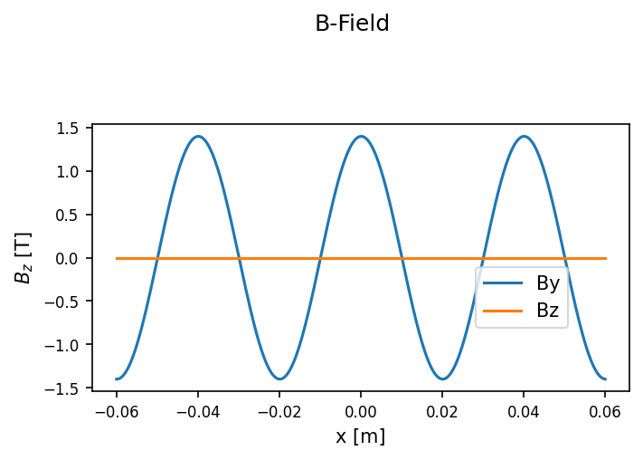

   Magnetic field generated by wave.

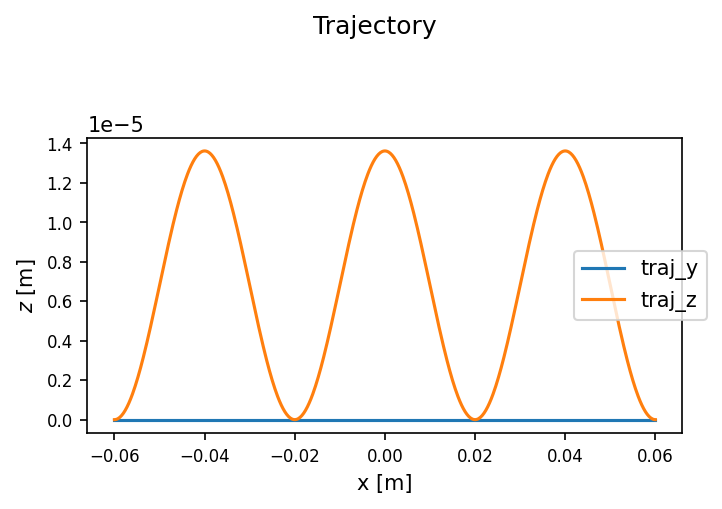

   Electron trajectory through the field.

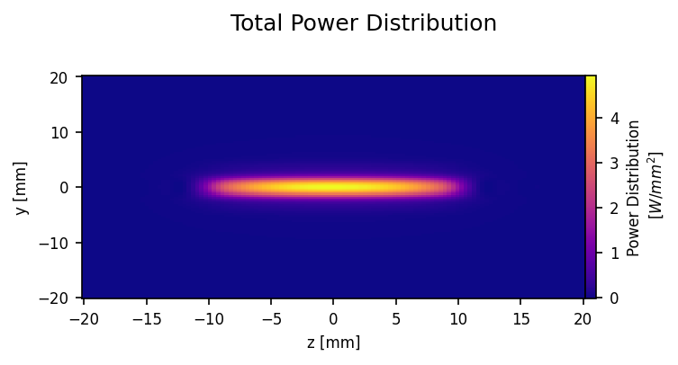

   Full radiation power emitted by the electron beam.

| The parameters that can be set are explained in the following paragraphs: 

General Parameters
-------------------------------

| There are a couple of parameter structures that allow to control the program flow. These are _ebeam_parameters, _screen_parameters, _spectrometer_paras, _undu_paras and _wave_prog_parameters. These are accessible vie the wave-object returned by a "unduwave.wave()" call and can be changed via the set-method as seen in the example above.

| The wave_prog_parameters control the program flow, result folders, number of cpu-threads for parallel computing, if energy spread and emittance are to be considered, and the general tracking parameters for the electron beam.

.. table:: _wave_prog_parameters
   :widths: auto

   =======================  ====================================    ===============  
     Parameter                  Description (Vals)                    Unit
   =======================  ====================================    =============== 
   res_folder               Main result folder                            -
   wave_data_res_folder     Subfolder for raw WAVE-res-data               -
   pics_folder              Subfolder holding result pics                 -
   nthreads                 Number of CPUs to use                         -
   calc_energy_fold         Fold spectrum (energy spread)                 -
   calc_emittance           Switch on/off emittance effects               -
   calc_spectrum            Switch on/off spectrum calculation            -
   electron_x0/y0/z0        Initial pos. of electrons                    [m]
   electron_intermediate_x  Intermediate long.pos. of electrons          [m]
   electron_end_x           Long. end position of electron               [m]
   electron_vx0/y0/z0       Initial unit-velocity of electron             -
   =======================  ====================================    ===============

| res_folder should be set before simulations (all folder should be set using pathlib.Path paths). calc_energy_fold and calc_emittance switch on energy spread and emittance calculations. The resulting spectrum is convoluted with a gaussian energy distribution and after that with the emittance defined by the parameters given in _ebeam_parameters. With electron_x/y/z0 the initial positions of the electron can be set - remember that the longitudinal position is given in units of [m] while transverse positions are given in [mm]. Setting an intermediate electron position via electron_intermediate_x forces the electron trajectory to traverse this longitudinal position on-axis. The tracking in effect starts at the point (electron_intermediate_x,0,0) and the electron is back-tracked from there to electron_x0 and then forward to electron_end_x. 

| The parameters of the electron beam - energy, current, beam geometry, energy spread, beta functions and ring parameters - are given here.

.. table:: _ebeam_parameters
   :widths: auto

   ===============  ==============================  ===============  
     Parameter       Description  (Vals)                     Unit
   ===============  ==============================  =============== 
   beam_en            Beam Energy                       GeV
   current            Beam Current                      A
   beamSizeHor        horizontal beam size              m
   beamDiveHor        horizontal beam divergence        rad
   beamSizeVer        vertical beam size                m
   beamDiveVer        vertical beam divergence          rad
   espread            Energy Spread                     %
   emittanceHor       Horizontal Emittance              m rad
   emittanceVer       Vertical Emittance                m rad
   betaFunctionHor    Horizontal Beta Function          m
   betaFunctionVer    Vertical Beta Function            m
   circumference      Ring Circumference                m
   rdipol             Bending Radius of Dipoles         m
   ===============  ==============================  ===============

| Radiation is calculated for a screen placed behind _wave_prog_paras.electron_end_x - the end position for electron tracking. The position, size and resolution of the screen can be set here.

.. table:: _screen_parameters
   :widths: auto

   ===================  ==============================  ===============  
     Parameter                Description  (Vals)            Unit
   ===================  ==============================  =============== 
   screen_extent_hor            Pinhole Width(z)              mm
   screen_extent_vert            Pinhole Height(y)            mm
   screen_pos_x                 Pinhole Position x            m
   screen_pos_y/z               Pinhole Position y/z          mm
   screen_pos_z           Number of horiz. Segments           -
   screen_pos_y           Number of vert. Segments            -
   ===================  ==============================  ===============

| Each segment of the screen acts as a spectrometer generating data for a given photon energy range and resolution.

.. table:: _spectrometer_paras
   :widths: auto

   ===================  ==============================  ===============  
     Parameter                Description (Vals)             Unit
   ===================  ==============================  =============== 
   spectrum_min_energy         Lowest Photon Energy           eV
   spectrum_max_energy         Highest Photon Energy          eV
   spectrum_n_energies         Number of energies             -
   spectrum_undu_mode          Undulator Mode (0/1)           -
   spectrum_wigg_mode          Wiggler Mode   (0/1)           -
   ===================  ==============================  ===============

| The undulator mode means the electron is tracked through one period of the device and the radiation on the screen is calculated. The radiation from the other periods is added coherently.

| Wiggler mode means the source points on the trajectory are identified and only the radiation from those is considered and added up incoherently. 

| If both modes are off, the expert mode is switched on. The whole trajectory is tracked and the radiation added together with appropriate phase-shifts between different points on the trajectory.

| If wave_mode='bfield', the program expects to be given magnetic field data by the user. In this case the _bfield_paras structure has to be used:

.. table:: _bfield_paras
   :widths: auto

   =======================  ====================================    ===============  
     Parameter                  Description (Vals)                    Unit
   =======================  ====================================    =============== 
   bfield                   magnetic field object                         -
   field_type               one of: ['By','Byz','Bxyz','bmap']            -
   =======================  ====================================    ===============

| If wave_mode="bfield", the magnetic field object has to be set in _bfield_paras and the field_type, which basically tells wave which part of the data to use. For 'By', 'Byz' and 'Bxyz' the on-axis magnetic fields are given. For 'bmap', the whole magnetic field map defined on some spatial area is used for the electron tracking. See `User-defined B-Fields`_ .

Wave Modes
-------------------------------

| The possible values for the wave_mode parameter are given here:

.. table:: wave_mode
   :widths: auto

   =======================  ====================================    ===============  
     Parameter                  Description (Vals)                    Unit
   =======================  ====================================    =============== 
   bfield                   Field is user-defined                         -
   undu_easy                Harmonic B-Field w/o ends                     -
   undu_endp                Harmonic B-Field w ends                       -
   undu_ellip               Elliptic B-field w/o ends                     -
   =======================  ====================================    ===============

Simple Undulators
-------------------------------

.. table:: _undu_paras
   :widths: auto

   ======================  ==============================  ====================  
     Parameter                   Description (Vals)                Unit
   ======================  ==============================  ==================== 
     unduParameterKY/Z              K-Value                        -
     bEffY/Z                     Effective B-Field                 T
     periodLength                  Period Length                   m
     numPeriods              	Number of Periods                  -
     elliptUnduPerShift              Shift                   % of periodLength
   ======================  ==============================  ====================

| Different parameters for setting simple undulator models. The strength of the undulator in vertical (Y) and horizontal (Z) directions can be set by unduParameterKY/Z or bEffY/Z. The period length and number of periods can also be set. For elliptical undulators (wave_mode='undu_ellip') also the shift can be set in percent of the period length. These models creates simple harmonic fields. 

| For wave_mode='undu_endp' simple end-fields are added such that the first and second field integrals on-axis are brought to zero. 

| For wave_mode='undu_ellip' the shift parameter can only take values 0.0, 0.25, 0.5, 0.75 and -0.5. Positive values correspond to parallel shift and the negative value corresponds to an anti-parallel shift. Elliptical undulators consist of 4 magnet rows arranged around the design-orbit with two rows above and two below the orbit. In parallel shift mode two rows that lie across each other (i.e. the upper left row and the lower right or vice versa) are moved in the same direction. In anti-parallel mode those two rows are moved in opposite directions.

| To produce more intricate magnetic fields for spectrum calculations - also corresponding to general shift states - see the documentation about the undu and bfield modules.

Simple Undulator with Endpoles
^^^^^^^^^^^^^^^^^^^^^^^^^^^^^^^^

All we have to do to add end poles to the above :ref:`simple undulator model <codeblockC>` is to change line 4 to:

.. code-block:: python
   :linenos:
   :lineno-start: 4
   
   wave = uw.wave(wave_mode='undu_endp') # Simple undulator model with endpoles
   
| This adds down- and up-stream end poles to the fields such that the first and second field-integrals vanish. The consequence of that is that the electron beam will have no net-displacement and net-deflection. The beam will exit the field the way it entered. 

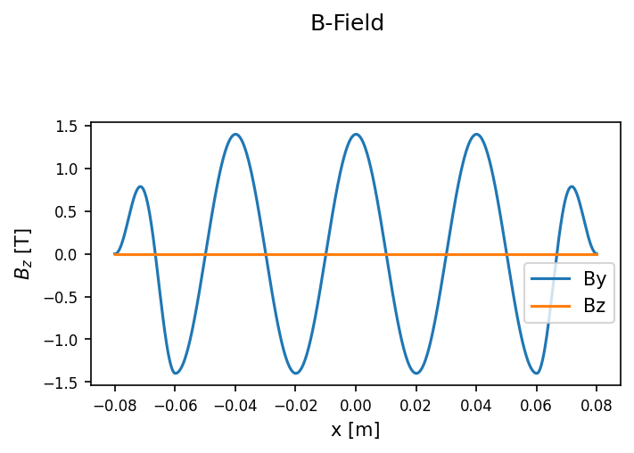

   Magnetic field with end poles.

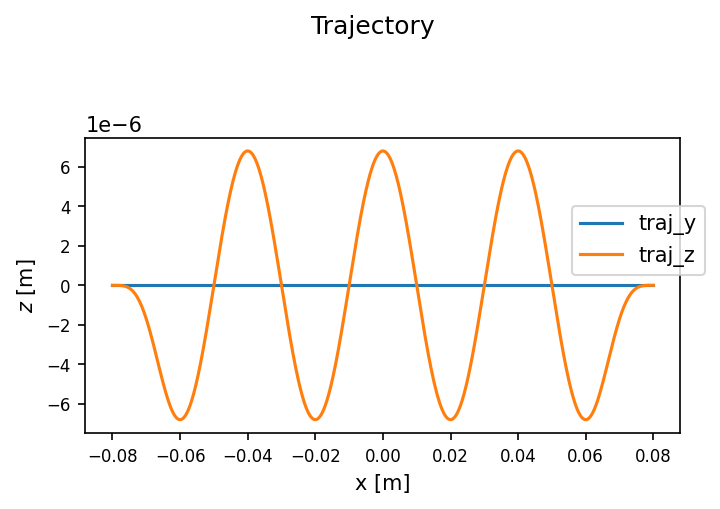

   Electron trajectory through the field - centered around 0.

| If we want to change the starting position and angles of the beam we can do that too. Add the following to the :ref:`simple undulator model <codeblockC>` in line 28:

.. code-block:: python
   :linenos:
   :lineno-start: 28
   
   wave_prog_paras.electron_x0.set(-0.2)
   wave_prog_paras.electron_y0.set(0.0)
   wave_prog_paras.electron_z0.set(-0.0002)

   v0=uw.unit_velocity_from_trans_angles(
   	hor_angle=+2e-4,
   	vert_angle=-1.2e-3)
   wave_prog_paras.electron_vx0.set(v0[0])
   wave_prog_paras.electron_vy0.set(v0[1])
   wave_prog_paras.electron_vz0.set(v0[2])
   
| The function unit_velocity_from_trans_angles takes the angle-displacements in [rad] of the initial y and z unit-velocity (|v|=1) components with the x-axis and translates this into a unit-velocity vector.

| We get a displaced trajectory:

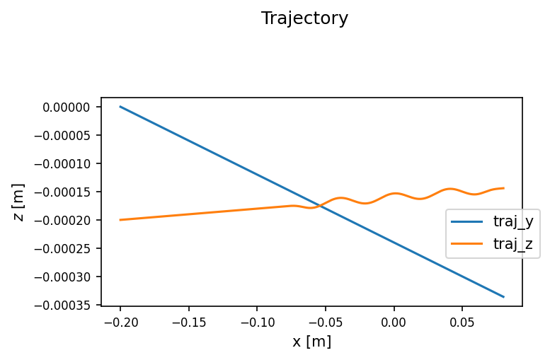

   Trajectory with displacement.

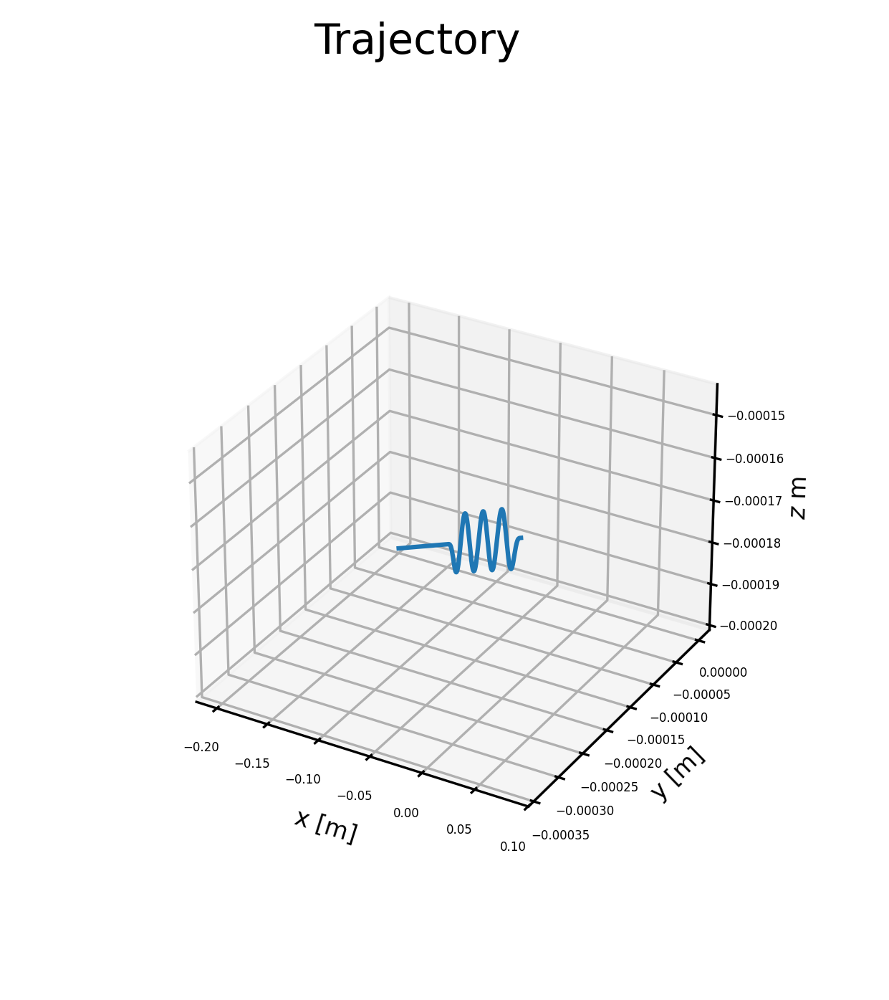

   3D-Trajectory with displacement.
   
.. note::
    Displacements of the initial electron beam will not work with wave_mode="undu_easy". This mode will try to expand the magnetic field. In general it is advised to work with self-created magnetic fields. See further below. 
   
Elliptical Undulator
^^^^^^^^^^^^^^^^^^^^^^^^^^^^^^^^

To make a simulation of an elliptical undulator model, we can change the undulator definition part in the :ref:`simple undulator model <codeblockC>` - line 4-18:

.. code-block:: python
   :linenos:
   :lineno-start: 4
   
   wave = uw.wave(wave_mode='undu_ellip')
   wave_prog_paras = wave._prog_paras

   """
   Setting Undulator Parameter
   """

   K_para_z=0.4
   K_para_y=0.8

   period_length = 0.0425 # m
   shift = 0.5 # percent of 1 period
   nperiods = 7

   undu_paras = wave._undu_paras # getting parameter object
   undu_paras.bEffY.set(b0_y)
   undu_paras.bEffZ.set(b0_z)
   undu_paras.numPeriods.set(nperiods)
   undu_paras.periodLength.set(period_length)
   undu_paras.elliptUnduPerShift.set(shift)

An elliptical undulator is created. The parameters are set - b0y and b0z - the vertical and horizontal B-amplitude. nper - the number of periods, perl_x - the period length and ell_shift the shift of the elliptical undulator in % of the period-length. 

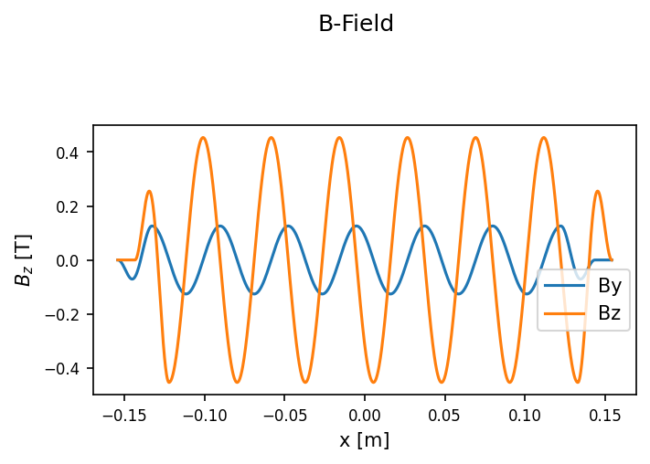

   Shift=0.25. Magnetic field for circular mode.

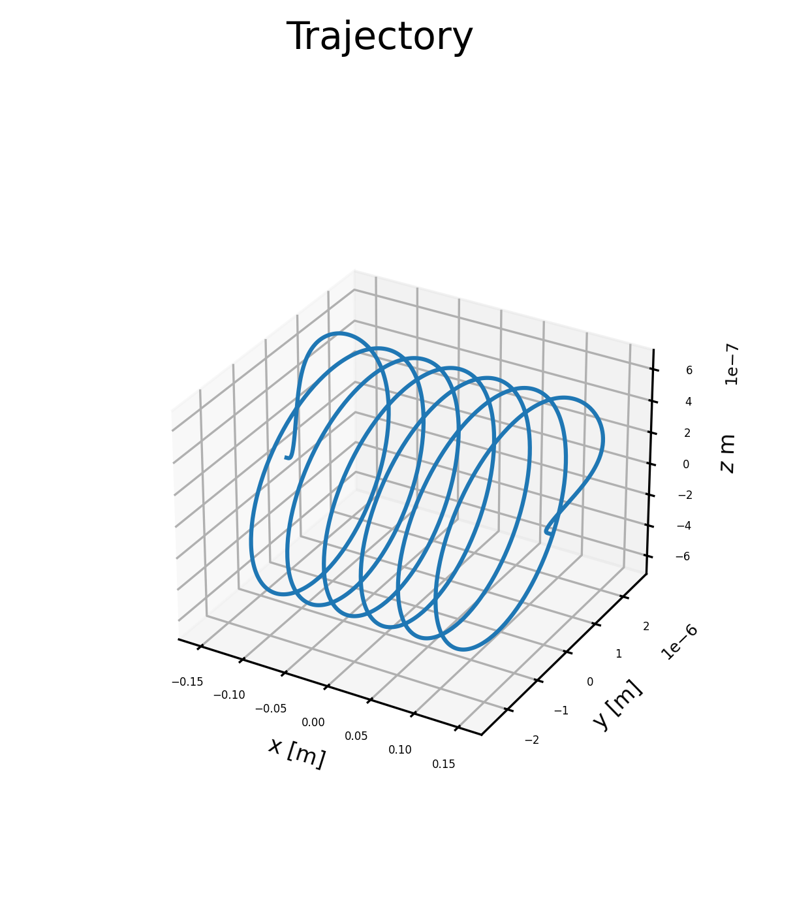

   3D-Trajectory for circular mode.
   
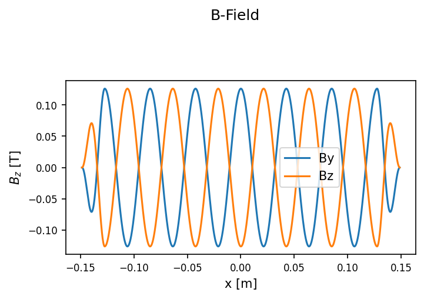

   Shift=0.-5. Magnetic field for inclined mode.

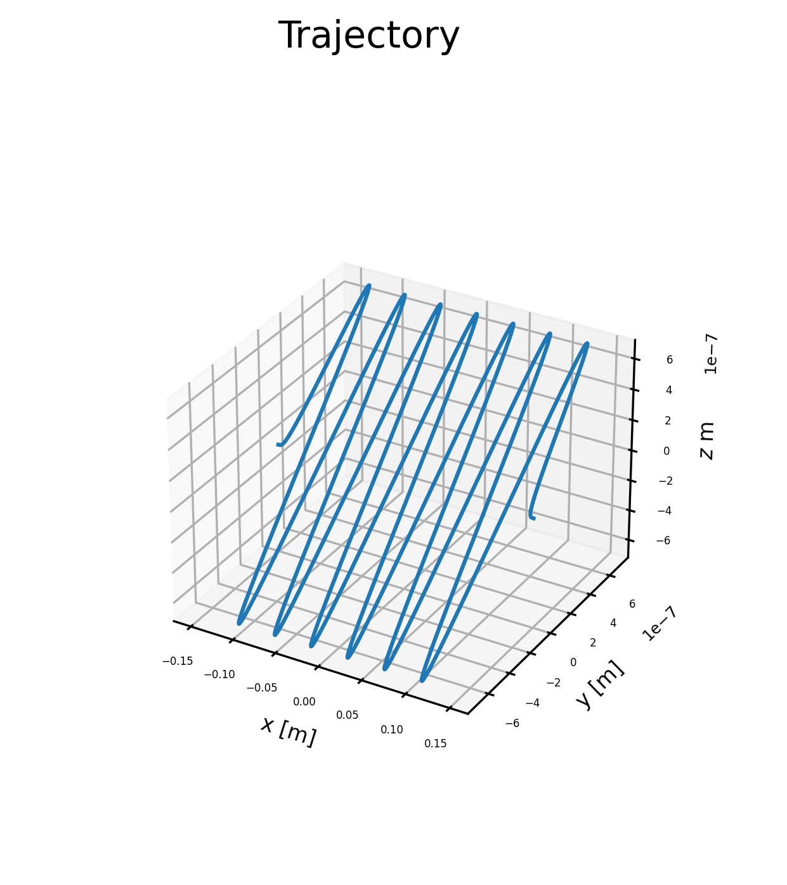

   3D-Trajectory in inclined mode.

.. note::
    This mode can only accompany some specific shift values: 0.0, 0.25, 0.5, 0.75 and -0.5. For shift 0 only bEffY is set internally and bEffZ=0. For shift = 0.5 vice versa: bEffY=0 and bEffZ is set to b0_z. If shift =0.25 or 
    0.75 both bEffY and bEffZ are set to their given values - with differing phase-shifts between both fields, resulting in left-handed or right-handed rotation of the electron beam around the axis. For shift=-0.5 both bEffY
    and bEffZ are set in phase, resulting in an inclined electron orbit. 
   
User-defined B-Fields
-------------------------------

We want to define the on-axis magnetic field through the device. To that end, set up a text file with two columns and no header. The first column is the longitudinal coordinate [mm], and the second is the magnetic field strength [T]. Then add to our old friend, the code for the :ref:`simple undulator model <codeblockC>`, beginning in line 4:

.. code-block:: python
   :linenos:
   :lineno-start: 4
   
   wave = uw.wave(wave_mode='bfield')
   
   """
   Loading and setting a BField
   """
   
   # Loading a file with x [mm] and By [T]
   
   bfield=uw.bfield.bfield(
   	unitsXB=[1e-3,1] # setting the units used in the file
   	)
   
   bfield.load_field_from_file(
   	file=Path('path/to/field/file'), 
   	fieldMap=False,
   	cols=['x','By'],  
   	unduFile = False,   
   	radiaFile=False,
   	header=None,
   	skiprows=None,
   )

   # make the field known to wave
   
   bfield_paras = wave._bfield_paras # get bfield paras
   bfield_paras.bfield.set(bfield) # set the bfield
   bfield_paras.field_type.set('By') # tell wave which part of bfield to use for simu

| This loads the magnetic field file into a bfield object and makes it known to wave. Using 'scripts/Wave_Examples/Spec_From_BField/spec_from_by/field_by_mm_T.dat' - available in the unduwave git repository - yields:

| We can now show some advanced simulation possibilities. We want to calculate the flux density distribution on the screen at the first harmonic photon energy. For that we calculate the effective magnetic field we just loaded. We can add this code to the :ref:`simple undulator model <codeblockC>` just after the creation of the electron beam parameters.

.. code-block:: python
   :linenos:
   :lineno-start: 1

   prd_lengths=bfield.find_period_length()
   beffGrid, beff_y, beff_z, longIntrvl=bfield.calc_beff_grid(
      prd_lngth=prd_lengths[0],
      )
   beff=beffGrid._g_funs[0,0,0,1]
   undulator=uw.undulator.undulatorCharacterization(
   	bEffY=beff,
   	periodLength=prd_lengths[0],
   	numPeriods=7,
   	bEffZ=0.0,
   	ebeam=ebeam_paras,
   	)
   firstHarmEnergy=undulator.firstHarmEnergyStrong()
   print(f"beff: {beff:.2f} T, periodLength: {prd_lengths[0]:.4f} m, \n firstHarmEnergy: {firstHarmEnergy:.2f} eV")

| find_period_length extracts the period lengths from the By and Bz fields and returns them in an array. calc_beff_grid allows to calculate the effectice magnetic field for a general magnetic field map. Here we only use on-axis data and have to extract the on-axis effective field value beff from the grid result. The undulatorCharacterization object takes some basic undulator parameters and the electron beam parameters and can be used to get a couple of useful information - e.g. the energy of the first harmonic. 

| We can use this information to plot the flux density distribution at the - or close - to the first harmonic. We change the spectrometer parameters to have a wider energy range simulated - including the first harmonic - and plot the distributions. In line 33 in the :ref:`simple undulator model <codeblockC>` we change:

.. code-block:: python
   :linenos:
   :lineno-start: 33
   
	spectrometer_paras = wave._spectrometer_paras
	spectrometer_paras.spectrum_n_energies.set(101)
	spectrometer_paras.spectrum_min_energy.set(250)
	spectrometer_paras.spectrum_max_energy.set(1000)

| And in the plotting section we add:

.. code-block:: python
   :linenos:
   :lineno-start: 97
	
	en_fd = results.get_result(which='en_fd')
	flux_density_onaxis = results.get_result(which='flux_density')
	nfig=flux_density_onaxis.plot_over(x_quant=en_fd,nfig=nfig)

	flux_dens_distr_ens_loaded = results.find_load_flux_density_distribution(energies=[int(firstHarmEnergy)])
	fd_y = results.get_result(which='fd_y')
	fd_z = results.get_result(which='fd_z')
	for en in flux_dens_distr_ens_loaded :
		fd = results.get_result(which=f'flux_density_distribution_{en:.2f}')
		nfig=fd.plot_over_3d(x_quant=fd_y,y_quant=fd_z,file_name=None,nosave=False,nfig=nfig)
	
The results are:

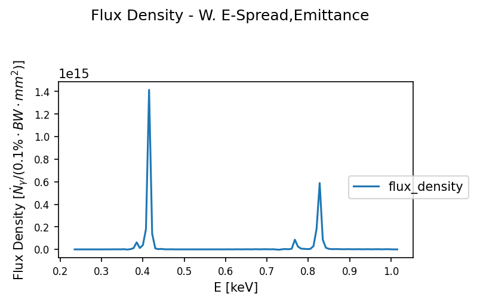

   The flux density of the emitted radiation from the loaded field.

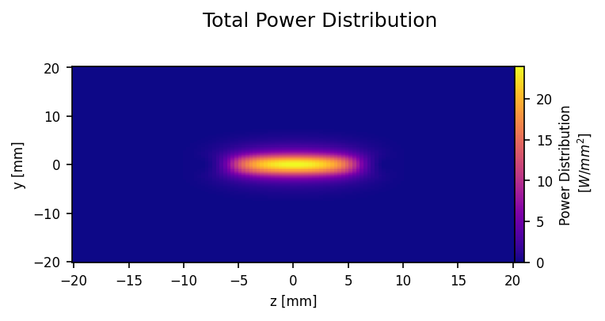

   The flux density distribution at the first harmonic energy - 411 eV.

.. note::
    This part of code has to be enclosed inside a 'if __name__ == '__main__':' block because the calc_beff_grid function uses multiprocessing.
      
User-defined B-Maps
-------------------------------

| You can also define and use your own magnetic field maps that can cover more than just the on-axis data. Change the code in the :ref:`simple undulator model <codeblockC>` beginning line 4 to:

.. code-block:: python
   :linenos:
   :lineno-start: 4

   wave = uw.wave(wave_mode='bfield')
   
   """
   Loading and setting a BField
   """
      
   bfield=uw.bfield.bfield(
   	unitsXB=[1.0,1.0] # setting the units
   	)
   
   bfield.load_field_from_file(
   	file=Path('path/to/field_map.map'), 
   	fieldMap=True,
   	cols=['x','y','z','Bx','By','Bz'],
   	skiprows=range(0,6), # here we ignore the first 6 lines of the file
      	)
   # make the field known to wave
   
   bfield_paras = wave._bfield_paras # get bfield paras
   bfield_paras.bfield.set(bfield) # set the bfield
   bfield_paras.field_type.set('bmap') # tell wave which part of bfield to use for simu

| First we tell wave that we want to simulate a custom magnetic field which we then load (setting the units in the file here to [m] and [T]). We load the file which hast to have 6 columns for x,y,z,Bx,By and Bz. The indices should run from the inside to the outside - i.e. first the z-index, then y and then x. All data should be on a rectangular grid. You can use the file scripts/Wave_Examples/Spec_From_BField_Map/field_map.map in the git repository as an example.
   
Observation Points
-------------------------------

Soon to come. Calculate spectra on custom defined observation point lists. 

The undu Module
================

Creating your first Magnet-Pole Pair
-------------------------------------

We create a magnet- and pole-block, position them and run the simulation, creating a magnetic field map.

.. _codeblockMP:

.. code-block:: python
   :linenos:

   import unduwave as uw
   from unduwave import undu_blocks
   import pathlib.Path as Path
   
   res_folder_full=Path('/path/to/folder')
   
   """
   Creating the undu module instance and populate the properties-structure
   """
   
   undu = uw.undu()
   undu_prog_paras = undu._prog_paras
   undu_prog_paras.res_folder.set(res_folder_full)
   undu_prog_paras.plotGeometry.set(1) # plotting a representation of magnet structure
   undu_prog_paras.create_z_sym.set(0) # do not apply symmetry operations
   undu_prog_paras.create_y_sym.set(0)
   undu_prog_paras.bmap_nz.set(10) # set the magnet map segmentation
   undu_prog_paras.bmap_nx.set(10)
   undu_prog_paras.center_magnet_struct.set(0)
   
   """
   Create some magnetic objects
   """
   
   pos_magn=np.array([ 0.0, -15.0, 0.0 ])
   magn_paras=undu_blocks.magParameters(
   	len_x_main=10, 
   	len_y_main=20,
   	len_z_main=30, 
   	segm_x=2,
   	segm_y=2,
   	segm_z=2,
   	frac_y=1,
   	frac_z=1,
   	chamf=0.3,   
   	magnetization=1.0,
   	magn_unit_vec='+x',
   	material_id="pm_rec",
   )

   magnet = undu_blocks.undumagBlockObject(
   	center=pos_magn,
   	magnParas=magn_paras,
   	name='MyMagnet',
   	parentName='',
   	)
   
   pos_pole=np.array([ 12.0, -15.0, 0.0 ])
   pole_paras=undu_blocks.magParameters(
   	len_x_main=5, 
   	len_y_main=15,
   	len_z_main=25, 
   	segm_x=3,
   	segm_y=9,
   	segm_z=5,
   	frac_y=9,
   	frac_z=5,
   	chamf=0.3,
   	material_id="fm_vanadium_permendur",
   )
   
   pole = undu_blocks.undumagBlockObject(
   	center=pos_pole,
   	magnParas=pole_paras,
   	name='MyPole',
   	parentName='',
   	)
   
   """
   Combine the objects to one data structure
   and make it known to the undu module
   """
   objs=undu_blocks.undumagObjectList(
   	magnet_blocks=[magnet,pole],
   	name='magnet_pole',
   	parentName='',
   	center=np.array([0.0,0.0,0.0]),
   	)  
   undu.set_magnet_objects(magn_objects=objs)
   
   """
   Run the simulation and retrieve results
   """

   undu.run()
   
   results = undu.get_results()

| Congrats. You just simulated your first magnet structure. First, the undu module is initialized and the _undu_prog_parameters set (see the :ref:`table <undu_prog_parameters>` below). Then the magnet parameter objects are filled for the magnet and the pole, setting their lengths, segmentation and material_id. "pm_rec" and "fm_vanadium_permendur" are available in the install. But custom material definition files can be added easily. pm_rec is a permanent magnet rare earch compound magnet and fm_vanadium_permendur is a highly ferromagnetic pole material. Furthermore, a parameter frac_y/z can be set. The higher this parameter, the smaller are the segments close to the axis - where the magnetic field has to be simulated accurately. chamf defines the size of a small cutout (45° angles) at the edges of the magnetic objects in down- and up-stream direction. 

| Then the actual magnetic objects are created via the undumagBlockObject function - setting a name for each object given. The objects are then grouped into a single structure with the undumagObjectList call and introduced to the undu module which then is run, producing a simulation of the resulting magnetic field.

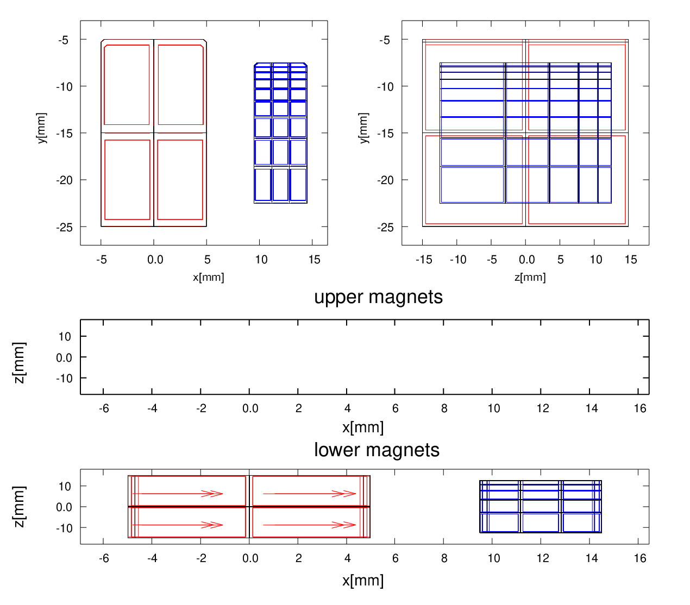

   The pole (blue) and magnet (red). Note the effect of frac_y/z on the segmentation of the pole. Also note the flat edges in the upper right plot of magnet and pole - those are chamfers.

In order to see some results, we do come plotting:

.. code-block:: python
   :linenos:
   :lineno-start: 88
   
   trajx = results.get_result(which='trajx')
   by = results.get_result(which='by')
   bz = results.get_result(which='bz')
   intBy = results.get_result(which='intBy')
   intBz = results.get_result(which='intBz')
   intBy2 = results.get_result(which='intBy2')
   intBz2 = results.get_result(which='intBz2')
   
   zProfile = results.get_result(which='profz')
   ByProfile = results.get_result(which='profBy')
   BzProfile = results.get_result(which='profBz')
   
   bmap = results.get_result(which='bmap')
   
   nfig=0
   by.plot_over(
   	x_quant=trajx,
   	nfig=nfig,
   	nosave=True,
   	clear=True,
   	)
   nfig=bz.plot_over(
   	x_quant=trajx,
   	nfig=nfig,
   	file_name=f'byz.png',
   	plot=False,
   	title=f'B$_y$ and B$_z$',
   	)
   
   intBy.plot_over(
   	x_quant=trajx,
   	nfig=nfig,   
   	nosave=True,   
   	clear=True,
   	)
   nfig=intBz.plot_over(
   	x_quant=trajx,
   	nfig=nfig,
   	file_name=f'intByz.png',
   	plot=False,
   	title=f'1. Integral of \n B$_y$ and B$_z$',   
   	)

   intBy2.plot_over(
   	x_quant=trajx,
   	nfig=nfig,
   	nosave=True,
   	clear=True,
   	)
   nfig=intBz2.plot_over(
   	x_quant=trajx,
   	nfig=nfig,
   	file_name=f'int2Byz.png',
   	plot=False,
   	title=f'2. Integral of \n B$_y$ and B$_z$',
   	)
   
   ByProfile.plot_over(
   	x_quant=zProfile,
   	nfig=nfig,
   	nosave=True,
   	clear=True,
   	)
   nfig=BzProfile.plot_over(
   	x_quant=zProfile,
   	nfig=nfig,
   	file_name=f'profileBz.png',
   	plot=False,
   	title=f'Profile of B$_y$ and B$_z$',
   	)

   bmap.plot_fld_map(
   	bWhat='By', # "Bx", "By" or "Bz"
   	xPos=None,
   	yPos=0.0,
   	zPos=None,
   	nfig=nfig,
   	filename=res_folder_full/"bymap.png",
   	title="By Map",
   	)

This code organizes the magnetic field values and the first and second field integrals, the field profiles (y-z-plots at x=0) and the created field map. It plots everything together. Note that in the plot_fld_map routine you can specify one coordinate, either xpos,ypos or zpos and will get a 2d plot of the map on the surface that is defined by this coordinate. E.g. if ypos=4 is given, the surface of the plot is defined by y=ypos=4.

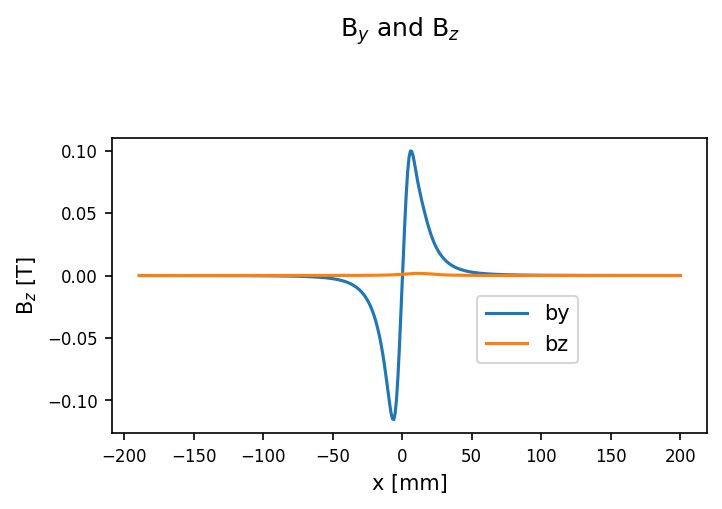

   The By(x) and Bz(x) fields.

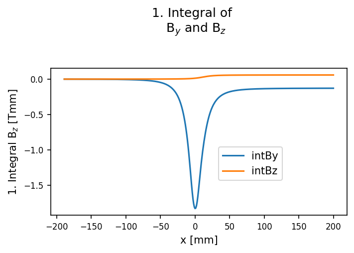

   The first integrals of the By(x) and Bz(x) fields.

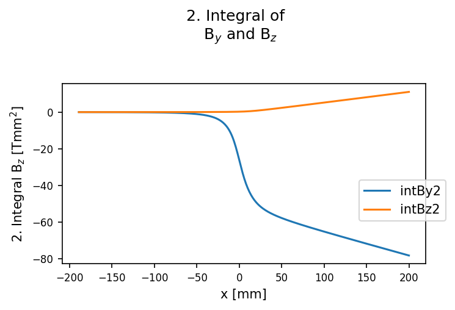

   The second integrals of the By(x) and Bz(x) fields.

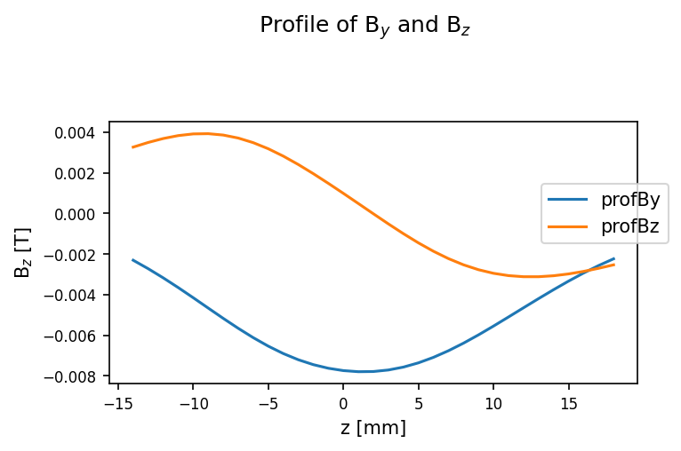

   The profiles of By(x=0,y,z) and Bz(x=0,y,z) fields.

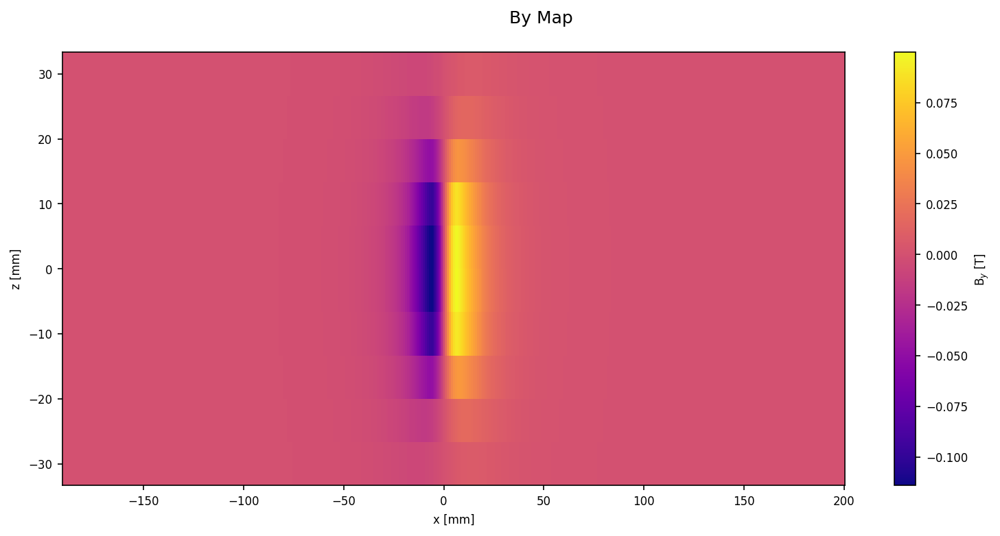

   The field map By(x,y=0.0,z)

The Parameter Structures
-------------------------------------

| These are the most important parameters to use with undu simulations.

.. _undu_prog_parameters:

.. table:: _undu_prog_parameters
   :widths: auto

   ============================  ========================================    ===============  
     Parameter                          Description (Vals)                       Unit
   ============================  ========================================    =============== 
   material_files_std_folders       List with material file folders               -
   res_folder                       Path('/result/folder/path')                   -
   periodLength                     Period Length                                [m]
   nthreads                         Number of threads (cpu) to use                -
   plotGeometry                     Create a plot file of the geometry            -
   create_x/y/z_sym                 Mirror the structure at x/y/z=0               -
   center_magnet_struct             center the magnet structure                   -
   magnetCoating                    add CuNi Coating layer around magnets        [mm]
   bmap_dx                          distance in x-dimension for map              [mm]
   bmap_nx/y/z                      segmentation of bmap in x/y/z                 -
   bmap_x/y/z_min                   minimum grid values for map                  [mm]
   bmap_x/y/z_max                   maximum grid values for map                  [mm]
   calc_force                       do force calculation?                         -
   plot_force                       plot force map                                -
   force_segm_x/y/z                 segmentation for force calculation            -
   shuffle                          shuffle the voxels during convergence         -
   convergence_iron_residuals       Convergence Criterion for Ferromagn.          -
   convergence_relative_b           Convergence Criterion for B-Field             -
   ============================  ========================================    ===============

| material_files_std_folders is a list containing the folder paths where material files are living. Add your own paths with material files to this list. Do not overwrite - if possible. Furthermore, the result folder, period lengths and number of cpus to use can be set and weather or not to plot the magnet structure. You can define your magnet structure only in one or two coordinate quadrants and using create_x/y/z_sym expand the structure to the whole space - if your full structure is symmetric. You can also center the structure longitudinally. You can also add a magnetCoating layer which is a magnetically inactive coating covering the magnets. 

| Then you can set the parameters for the magnetic field map you want to create and for the force calculations. 

| Unduwave, which lies at the core of the undu module, calculates the relaxation of ferromagnetic elements in the total magnetic field created by all elements. This is done by a fixed-point calculation which converges for all elements of the structure to their equilibrium magnetizations. These are then used to calculate the magnetic field at any given point. shuffle is a parameter that, if switched on, shuffles the order of magnets being relaxed during each iteration. This can help to get calculations of huge systems containing many ferromagnetic parts to converge. convergence_iron_residuals gives the maximum relative error for the magnetization values of the iron material relative to the magnetization curve B(H) that defines their behavior. convergence_relative_b gives the maximum relative deviation for the magnetic field values on successive iterations of the relaxation. When both criteria are met, the simulation finishes.

Calculating Forces and Torques
-------------------------------------

We add the following code to our :ref:`Magnet-Pole system <codeblockMP>` in line 84:

.. code-block:: python
   :linenos:
   :lineno-start: 1

   undu.set_force_calc(
   	object=magnet,
   	segmentations=np.array([20,50,50]),
   	)
   
   undu.run()
   results = undu.get_results()
   forces=results._summary['force']
   torques=results._summary['torque']
   print(f"The forces are {forces}, and torques: {torques}")

This tells undu to set-up the force calculation on object magnet, created earlier. Note that the force calculation works by creating a box surrounding the object in question and calculating the forces on the sides of the box. 

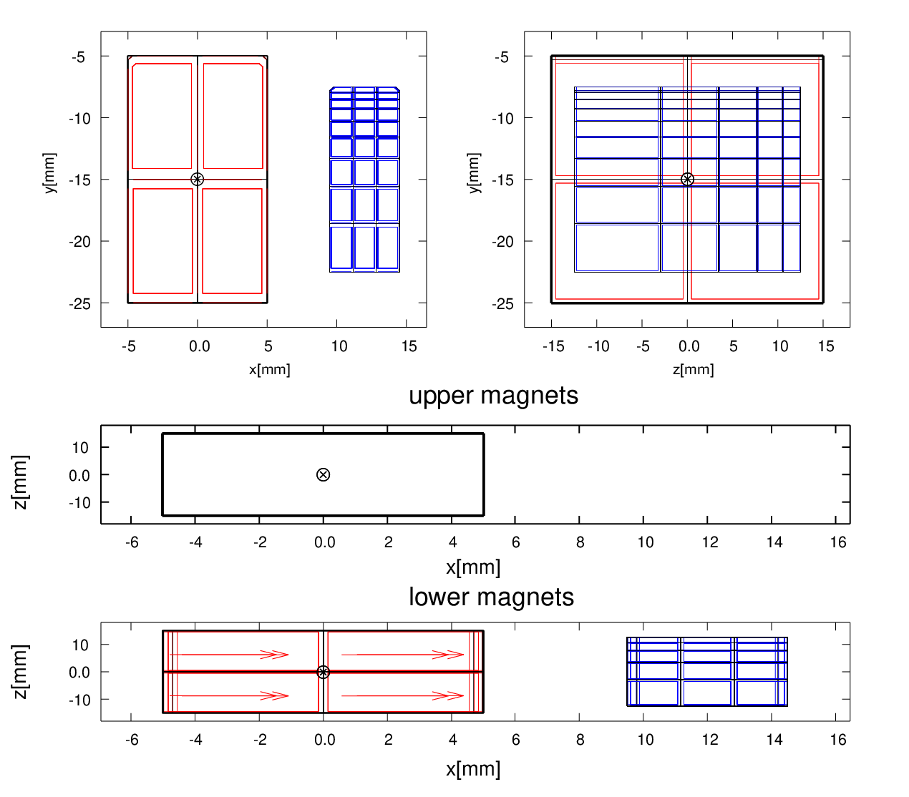

   A black box is drawn around the element for which the force and torque is calculated.

Creating Current Carrying Coils
-------------------------------------

We can create current carrying coils and add them to the magnetic system like so. Replace the lines 25 to 78 in the :ref:`Magnet-Pole system <codeblockMP>` by:

.. code-block:: python
   :linenos:
   :lineno-start: 25

   pos_magnet=np.array([ 0.0, -15.0, 0.0 ])
   center_coil = np.array([0.0,-20.0,0.0])
   normal_vec = np.array([1.0,0.0,0.0])
   
   """
   standard orientation for interpretation of the variable names is in 
   (0,1,0) direction, so the coils lying in the x-z plane. 
   
   coil_len_x - extent of coil in x-direction
   coil_thick - thickness of coil in x-z-plane
   outer_z - outer length of coil in z-direction
   inner_z - inner length of coil in z-direction
   inner_r - the inner curvature of the coils at the edges, the higher, the more circle-like
   height - the extent in y-direction
   segm_v - segmentations
   segm_h=10
   segm_r=10
   filling-the percentage of coil querschnitt filled by coils
   wire_diameter - diameter of one wire
   n_windings=int(height*coil_thick/(math.pi*wire_diameter**2))
   """
   
   coil_len_x=200 
   coil_thick=20
   outer_z=90
   inner_z=outer_z-2*coil_thick
   inner_r=20
   height=5
   segm_v=10
   segm_h=10
   segm_r=10
   filling=0.6
   wire_diameter=1
   n_windings=int(height*coil_thick/(math.pi*wire_diameter**2))
   
   coil = uw.undu_coils.coil(
   	coil_type='RectWindings', 
   	current=1.0,
   	center=center_coil,
   	normal_vec=normal_vec, 
   	rot_angle=0.0,
   	length=coil_len_x,
   	inner_z=inner_z,
   	outer_z=outer_z,
   	inner_radius=inner_r, 
   	height=height,
   	n_vert=segm_v,
   	n_hor=segm_h,
   	n_rad=segm_r,
   	filling = filling, 
   	n_windings = n_windings,
   	)
   
   magn_paras=undu_blocks.magParameters(
   	len_x_main=10, 
   	len_y_main=20,
   	len_z_main=30, 
   	segm_x=2,
   	segm_y=2,
   	segm_z=2,
   	frac_y=1,
   	frac_z=1,
   	chamf=0.3,
   	material_id="pm_rec",
   )
   
   magnObject = undu_blocks.undumagBlockObject(
   	center=pos_magnet,
   	magnParas=magn_paras,
   	name='MyMagnet',
   	parentName='',
   	)
   
   objs=undu_blocks.undumagObjectList(
   	magnet_blocks=[coil,magnObject],
   	name='magnet_coil',
   	parentName='system',
   	api=None,
   	center=np.array([0.0,0.0,0.0]),
   	)
   
This creates a coil object with all the parameters explained in the code and an magnet. It combines both to a single object and then runs the usual simulations. 

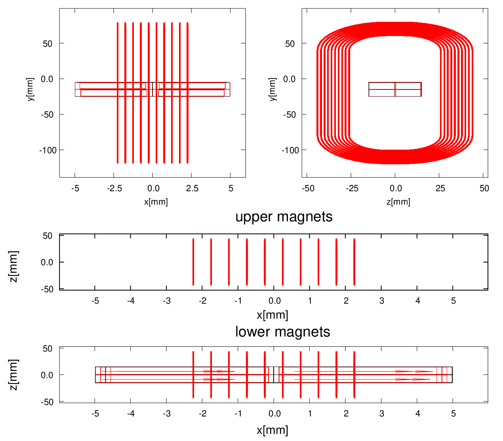

   A coil and a magnet.
   
.. _ch-kicksngrids:

Kicks And Grids
-------------------------------------

Here we show how to use some advanced features that have to do with magnetic fields. We calculate the integrals for a field map, the effective magnetic fields and the kicks experienced by the electron beam.

.. code-block:: python
   :linenos:
   :lineno-start: 1
   
   import unduwave as uw
   import pathlib.Path as Path

   wave=uw.wave()
   
   ebeam_paras = wave._ebeam_paras
   ebeam_paras = ebeam_paras.get_std_bessy_III_paras()
   beamEnGeV=ebeam_paras.beam_en()

   res_folder_full=Path('path/to/results')
   loadFile=Path('path/to/field_map')

   processes=6
   period_length=42.5

   """
   Loading a field map
   """
   bmap=uw.bfield.bfield(
   	unitsXB=[1.0,1.0] # setting the units
   	)

   bmap.load_field_from_file(
   	file=loadFile,
   	fieldMap=True,
   	unduFile = True, 
   )

   bmap=bmap.center()

   """
   Create a grid for the bfield map. On this grid the field values can be interpolated
   Plot the grid map and calculate integrals, beffs and kicks. 
   Those calculations are done with the bfield object, but the results returned
   as grid objects so that they can easily be interpolated
   """
   unduRepr=bmap.create_grid_interpolation()
   unduRepr.processes=processes

   unduRepr.plot_grid_map(
   	indPlot=1, # 0-Bx,1-By,2-Bz
   	zlab='',
   	yPos=0.0,
   	save=True,
   	filename=Path('path/to/picfile'),
   	title=f"By(x,z)",
   	)

   firstIntGrid, scndIntGrid=bmap.calc_integrals_grid(
   	intrgnt_limit=400, 
   	epsrel=1e-3,
   	epsabs=1e-5,
   	processes=processes,
   	)

   for plt in [[firstIntGrid,'first'],[scndIntGrid,'second']]:
   	plt[0].plot_grid_map(
   		indPlot=1,
   		zlab='',
   		xPos=plt[0]._g_xvals[-1], # plot at the last x-value
   		save=True,
   		filename=Path('path/to/picfile'),
   		title=f"By(x=last value,y,z)",
		)
   	plt[0].write_grid_data(
   		file=Path('path/to/datafile'),
   		cols=['x','y','z',f'{plt[1]}_intgrlBx',f'{plt[1]}_intgrlBy',f'{plt[1]}_intgrlBz'],
   		)

   beffs, ys, zs, longIntrvl=bmap.calc_beff_grid(
   	longIntrvl=[-period_length/2.0,period_length/2.0],
   	prd_lngth=period_length,
   	intrgnt_limit=None, 
   	n_max = 10, 
   	epsrel=1e-3,
   	epsabs=1e-5,
   	processes=processes,
   	)

   beffs.plot_grid_map(
   	indPlot=plt[0],
   	zlab='',
   	xPos=period_length,
   	save=True,
   	filename=Path(..'),
   	title=f"Effective $B_{y,eff}$-Map",
   	)

   kicksy_h, kicksz_h, pot_map =bmap.calc_kicks_grid(
   	longIntrvl=[-period_length/2.0,period_length/2.0],
   	prd_lngth=period_length,
   	n_max = 10, 
   	epsrel=1e-3,
   	epsabs=1e-5,
   	processes=processes,
   	method='harmonic', # harmonic or full
   	beamEnGeV=beamEnGeV, # Beam Energy in GeV, beamEnGeV
   	)

   for plt in [[kicksy_h,'Ky'],[kicksz_h,'Kz']]:
   	plt[0].plot_grid_map(
   		indPlot=0,
   		zlab='',
   		xPos=plt[0]._g_xvals[-1], # plot on last x-value kicks(y,z)
   		save=True,
   		filename=Path('...'),
   		title=f"Harmonic {plt[1]}-Map",
   		)

| We start by importing the module and loading a field map (e.g. the map in: scripts/Undumag_Examples/CalcKicks/field_map.map included in the git repository for a 42.5 mm elliptical undulator in a shift state -0.25, i.e. in anti-parallel mode). In line 37 a grid_interpolator object is created using the loaded magnetic field. This objects allows for easy interpolation of data on a regular 3D grid. Then the By component is plotted using the plot_grid_map member function. 

| We calculate the field integrals for all components of B using calc_integrals_grid in line 49. This returns a grid_interpolator object which can then easily be plotted. The field integrals are calculated for all transverse points on a screen positioned at the last x value downstream - so for line parallel to the center through the device. calc_beff_grid in line 70 works accordingly but calculates the effective magnetic field along parallel lines through the center on a transversal grid.

| In line 89 the kicks in both transversal directions are calculated. There are two modes: "full" and "harmonic". Full solves the full second order equations for the kicks given the magnetic field. "harmonic" calculates the kicks replacing the true magnetic field with a harmonic approximation given by the effective magnetic field. 

| When using the full mode, calc_kicks_grid returns two more results - the grids of the transverse gradients of the magnetic field integrals.

.. code-block:: python
   :linenos:
   :lineno-start: 1
   
   kicksy, kicksz, pot_map_f, gY,gZ =bmap.calc_kicks_grid(
   	prd_lngth=period_length,
   	intrgnt_limit=400, 
   	n_max = 10, 
   	epsrel=1e-3,
   	epsabs=1e-5,
   	processes=processes,
   	method='full',
   	beamEnGeV=beamEnGeV, # Beam Energy in GeV, beamEnGeV
   	)

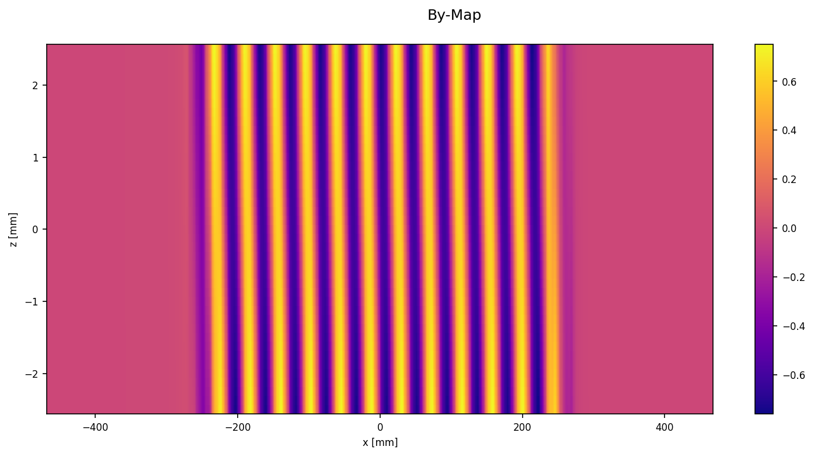

   A high resolution field map of a small 42.5 mm undulator in -0.25 shift state.

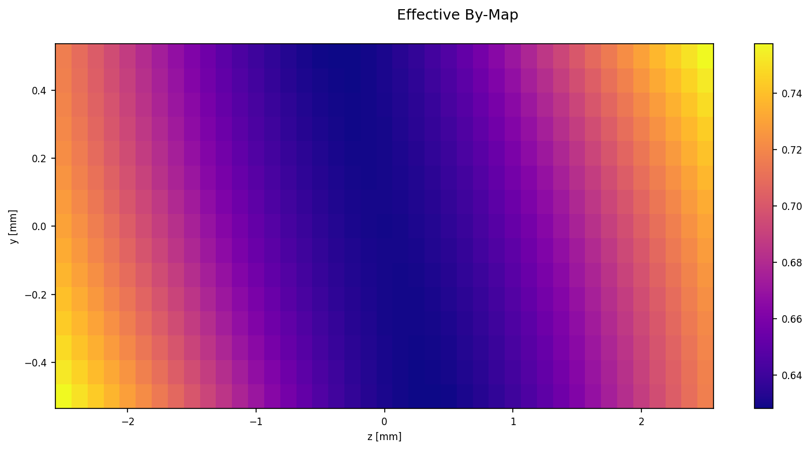

   High resolution map of the Effective By(x=end,y,z).

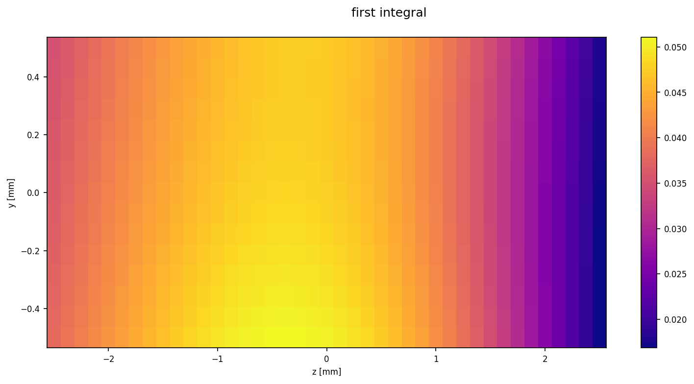

   High resolution map of the first integral of By along the axis.

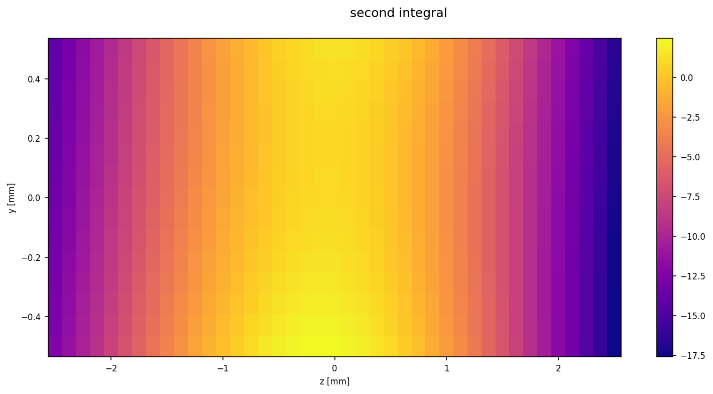

   High resolution map of the second integral of By along the axis.

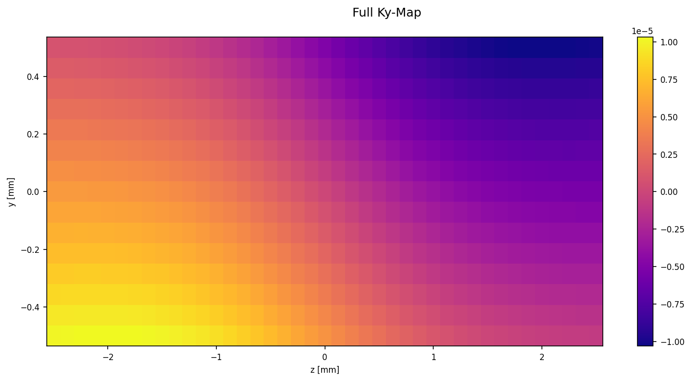

   High resolution map of the vertical kick.

Custom Magnetic Materials
-------------------------------------

| It is possible to define your own magnetic materials easily. There are two main types of material used here: Permanent magnets and ferromagnets. There are 3 materials pre-defined. A permanent magnet material (Pr,Nd)2 Fe14 B and a pole material called Vanadium Permendur.

Permanent magnets are defined by their susceptibilities parallel to the easy-axis and by their susceptibilities perpendicular to the easy-axis. The material is defined in a file, e.g. my_material.dat, like so ::

   type: magnet
   id: super_material
   ksi_Par and ksi_Per # parallel and perpendicular (to easy axis) susceptibilities
   0.03 0.17

| This defines a permenant magnet material - therefor we have "type: magnet". The line "id: my_magnet" defines the id, or name, of the material defined here. This material name/id can then be invoked in a python magnet-object definition. See below. Put this file into some folder "mymaterials". The material definition files have to end on ".dat".

To define a ferromagnetic material, we create a definition file - e.g. mypole.dat - which looks like this ::

   type: pole
   id: super_material_pole
   H M # [T]
       1.0e-30 1.0e-30
       0.10000e-08    0.10734e-04
       0.20000e-08    0.21468e-04
       ...
       1.9 2.339997
       2.2 2.339998
       2.5 2.339999
       10. 2.34
        
| This defines the magnetization curve H(M) for the ferromagnetic material in question. 

| To run a simulation using your own material definitions, do:

.. code-block:: python
   :linenos:
   :lineno-start: 1
   
   import unduwave as uw
   from unduwave import undu_blocks

   material_folder=Path("path/to/mat/folder")

   undu = uw.undu(undu_mode='from_undu_magns')
   undu_prog_paras = undu._prog_paras
   undu_prog_paras.res_folder.set(Path("path/to/res/folder"))
   undu_prog_paras.create_z_sym.set(0)
   
   mat_folders=undu_prog_paras.material_files_std_folders()
   mat_folders.append(material_folder)
   undu_prog_paras.material_files_std_folders.set(mat_folders)
   
   pos=np.array([ -15.0, 0.0, 0.0 ])
   magn_paras=undu_blocks.magParameters(
   	len_x_main=10, 
   	len_y_main=20,
   	len_z_main=30, 
   	segm_x=2,
   	segm_y=2,
   	segm_z=2,   
   	frac_y=1,
   	frac_z=1,   
   	chamf=0.3,
   	material_id="super_material",
   )
   
   magnObject = undu_blocks.undumagBlockObject(
   	center=pos,
   	magnParas=magn_paras,
   	name='MyMagnet',
   	parentName='',
   	api=undu,
   	)
   
   pos=np.array([ 15.0, 0.0, 0.0 ])
   pole_paras=undu_blocks.magParameters(
   	len_x_main=10, 
   	len_y_main=20,
   	len_z_main=30, 
   	segm_x=2,
   	segm_y=2,
   	segm_z=2,   
   	frac_y=1,
   	frac_z=1,   
   	chamf=0.3,
   	material_id="super_material_pole",
   )
   poleObject = undu_blocks.undumagBlockObject(
   	center=pos,
   	magnParas=pole_paras,
   	name='MyMagnet2',
   	parentName='',
   	api=undu,
   	)
   
   objs=undu_blocks.undumagObjectList(
   	magnet_blocks=[magnObject,poleObject],
   	name='magnet_sys',
   	parentName='',
   	center=np.array([0.0,0.0,0.0]),
   	)
   
   undu.set_magnet_objects(magn_objects=objs)
   
   undu.run()

In line 11-13 the material_files_std_folders list is updated with a new material folder. Copy your super_material definition files to this folder. Then use the id's you defined in the material files like in line 26 or 48. Your material definitions are now used for the subsequent simulations.
   
Creating Undulators
-------------------------------------

Unduwave comes equipped with infrastructure to create complex undulators in relative simple steps. To see how this works, take a look at the following code.

.. note::
   A general undulator (elliptical) consists of 4 different rows arranged around a central axis (along which the electron-beam 
   travels). The naming convention for the 4 rows used here is based on looking face-on at the undulator in downstream direction. 
   Then there are the lower left (ll), lower right (lr), upper right (ur) and upper left (ul) row. These 4 rows can - in the 
   case of elliptical machines - move longitudinally and independently from each other. 

.. _codeblockUnduCreate:

.. code-block:: python
   :linenos:
   :lineno-start: 1
   
   import unduwave as uw 
   from unduwave.unduwave_incl import *
   from unduwave import undu_blocks
   from unduwave import undulatorComponents

   """
   Some general undulator parameters
   """
   gap = 5.5 # The distance between upper and lower rows [mm]
   nperiods=3 # number of periods
   shift = 0.25 # relative shift in % of period length

   period_length=24 # period length [mm]
   glue_slit= 0.102 # longitudinal distance btwn two magnets
   keeper_slit_fm= 0.258 # distance between glued-together magnet pairs
   row_slit=0.795 # distance between lower/upper left and right row
   magnetization=1.58 # the absolute magnetization of magnets

   # find the magnet lengths, such that we get the right period length
   slitLenPerPeriod=2*glue_slit+2*keeper_slit_fm
   magnLen=(period_length-slitLenPerPeriod)/4

   """
   Setting general undu parameters
   """
   undu = uw.undu(undu_mode='from_undu_magns')
   undu_prog_paras = undu._prog_paras
   undu_prog_paras.res_folder.set(Path("/res/folder/path")
   undu_prog_paras.periodLength.set(period_length*1e-3)# undu_prog_paras takes the period_length in [m]

   undu_center = np.array([0.0,0.0,0.0]) # machine center

   """
   Create the Periodic Magnet Parameters and Object
   """

   magnParas=undu_blocks.magParameters(
   	len_x_main=magnLen, 
   	len_y_main=23.5,
   	len_z_main=23.5, 
   	material_id="pm_rec", 
   )
   # position magnet (ll) such that it is situated entirely in one quadrant, in accordance with row_slit
   # gap comes later
   llMagnPos=np.array([0.0,-magnParas._len_y_main()/2.0,-magnParas._len_z_main()/2.0-row_slit/2.0])
   magnet = undu_blocks.undumagBlockObject(
   	center=llMagnPos,
   	magnParas=magnParas,
   	pnts=None,
   	name="mag",
   	)
   
   """
   Create a period consisting of 4 identical magnets - except for their magnetization direction
   
   Not that the period starts not with the magnet but with half a keeper slit.
   """
   
   mag1=magnet.get_copy(name='m1')
   mag1.move_it(vec=np.array([-period_length/2.0+keeper_slit_fm/2.0+magnParas._len_x_main()/2.0,0.0,0.0]))
   
   mag2=magnet.get_copy(name='m2')
   mag2.move_it(vec=np.array([mag1._center[0]+magnParas._len_x_main()+glue_slit,0.0,0.0]))
   
   mag3=magnet.get_copy(name='m3')
   mag3.move_it(vec=np.array([
   	mag2._center[0]+magnParas._len_x_main()+keeper_slit_fm,0.0,0.0]))
   
   mag4=magnet.get_copy(name='m4')
   mag4.move_it(vec=np.array([mag3._center[0]+magnParas._len_x_main()+glue_slit,0.0,0.0]))

   period_objects=[mag1,mag2,mag3,mag4]
   
   # creating the period object
   period=undulatorComponents.period(
   	period_length=period_length*1e-3,
   	objects=period_objects, # list of objects making up one period
   	center=np.array([0.0,0.0,0.0]),
   	name='period1'
   )
   
   # define the magnetizations of the periodic magnets
   periodicMagnetizationSequence=[
   	np.array([ 0.0, magnetization,0.0 ]),
   	np.array([ -magnetization, 0.0,0.0 ]),
   	np.array([ 0.0, -magnetization, 0.0 ]),
   	np.array([ magnetization, 0.0,0.0 ]),
   	]
   # create the lower left row - it is used as a template to create all other rows too
   row=undulatorComponents.row(
   	pos='ll',
   	period=period,
   	period_length=period_length,
   	center=np.array([0.0,0.0,0.0]),
   	name='row1',
   	nperiods=nperiods,
   	periodicMagnetizationSequence=periodicMagnetizationSequence,
   	)
   # create the full undulator
   undulator=undulatorComponents.undulator(
   	name='myUndu',
   	period_length=period_length,
   	accelerator='myAccelerator',
   	rows=[row],
   	center=np.array([0.0,0.0,0.0]),
   	gap=gap,
   	shift=shift,
   	construct_quadrants=['ll','lr','ul','ur'],
   	api=undu,
   	)   
   undu.set_magnet_objects(magn_objects=undulator)
   # Simulate
   undu.run()

| First, we import the module and set some general undulator parameters like gap, number of periods, shift and some other geometrical properties. Then we define a simple block magnet in lines 37-46. In lines 57 to 70 this magnet object is copied 4 times and those four objects are used to create the period object in line 73. Then the magnetization sequence for the periodic part is defined in line 81, a row-object constructed from the period in line 88 and for there the full undulator object is created in line 98 and finally simulated. 

.. note::
   The undulator, row, period and unduMagBlock objects are all instances of the undumag.undumagObjectList class. Each of them containing sub-objects which in turn may contain other objects. The undulator objects then is a list of all row objects, which contain the end configurations (see next chapter) and the periods and so on down to the single blocks that may constitute one magnet or pole. Each of those objects holds, among other properties, a "_center" member variable which holds the coordinates of this object. These coordinates are relative with respect to the coordinates of any containing object. So the coordinates of a row, :math:`c_R`, are relative to the coordinates of the undulator :math:`c_U` - if the undulator is not contained in some other strucutre. The total coordinates of the row are then: :math:`c=c_R+c_U`. 

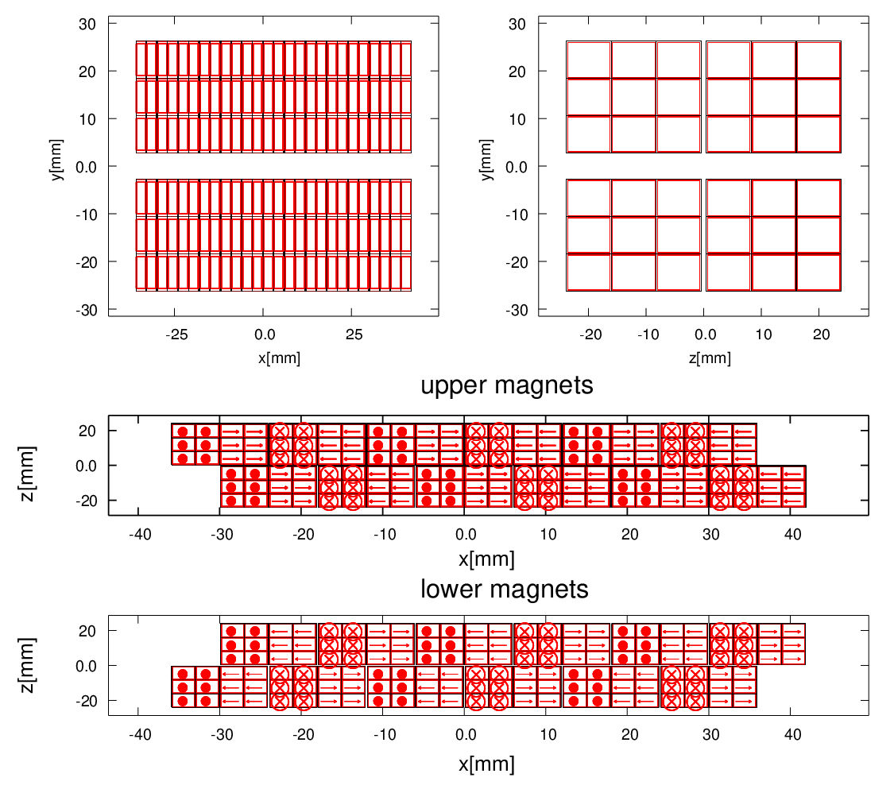

   A simple elliptical undulator in 0.25 shift state. No end structures.

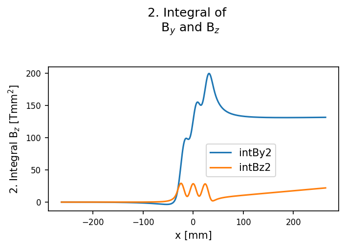

   Second field integrals. 

Adding End Structures
^^^^^^^^^^^^^^^^^^^^^^^^^^^^^^^^^^^^

There is also infrastructure to easily add end-structures to the device. To add, e.g., the upstream end section we can add the following code to line 87 in the undulator creation :ref:`script <codeblockUnduCreate>`.

.. _codeblockEnd:

.. code-block:: python
   :linenos:
   :lineno-start: 87
   
   len_upStrm=magnParas._len_x_main()*2.5

   endMagn1Paras=copy.deepcopy(magnParas)
   endMagn1Paras._len_x_main.set(endMagn1Paras._len_x_main()*0.25)

   endMagn2Paras=copy.deepcopy(magnParas)
   endMagn2Paras._len_x_main.set(endMagn2Paras._len_x_main()*0.5)

   endMagn3Paras=copy.deepcopy(magnParas)
   endMagn3Paras._len_x_main.set(endMagn3Paras._len_x_main()*0.75)

   endmag1Pos_upStrm=copy.deepcopy(llMagnPos)
   endmag1Pos_upStrm[0]=-len_upStrm/2.0+0.5*endMagn1Paras._len_x_main()
   endMagn1_upStrm = undu_blocks.undumagBlockObject(
   	center=endmag1Pos_upStrm,
   	magnParas=endMagn1Paras,
   	name="em1UpS",
   	)

   endmag2Pos_upStrm=copy.deepcopy(llMagnPos)
   endmag2Pos_upStrm[0]=endmag1Pos_upStrm[0]+0.5*endMagn1Paras._len_x_main()+\
   		magnParas._len_x_main()*0.5+endMagn2Paras._len_x_main()*0.5
   endMagn2_upStrm = undu_blocks.undumagBlockObject(
   	center=endmag2Pos_upStrm,
   	magnParas=endMagn2Paras,
   	name="em2UpS",
   	)

   endmag3Pos_upStrm=copy.deepcopy(llMagnPos)
   endmag3Pos_upStrm[0]=endmag2Pos_upStrm[0]+0.5*endMagn2Paras._len_x_main()+\
   		magnParas._len_x_main()*0.5+endMagn3Paras._len_x_main()*0.5
   endMagn3_upStrm = undu_blocks.undumagBlockObject(
   	center=endmag3Pos_upStrm,
   	magnParas=endMagn3Paras,
   	name="em3UpS",
   	)

   upstream_end_objects=[
   	endMagn1_upStrm,endMagn2_upStrm,endMagn3_upStrm
   	]
   endUpStream=undulatorComponents.endConfig(
   	dist_period=0.0, # a possible gap between end config and the start of the periodic part
   	objects=upstream_end_objects, # list of objects making up one period
   	center=np.array([0.0,0.0,0.0]),
   	name=''
   )

| This creates a standard end structure for permanent magnet undulators containing magnets differing from magnets in the periodic part only by their lengths - 0.25, 0.5 and 0.75 times the length of the periodic magnets. The end-magnets are arranged with appropriate distances between them - resulting in an end structure with 2.5 times the length of a single periodic magnet - line 87. Adding an equivalent but mirrored structure to the downstream end of the undulator brings the first and second field integrals through the device close to zero on-axis and for all possible gaps and shifts. 

| The magnets are arranged longitudinally - e.g. in line 99 - and then all grouped together and transformed into an endConfig object in lines 124-127.  

| If we create an equivalent end configuration for the downstream end, calling it endDownStream, we can now change the row definition in the original :ref:`code <codeblockUnduCreate>` in line 88 to:

.. code-block:: python
   :linenos:
   :lineno-start: 88
   
   row=undulatorComponents.row(
   	pos='ll',
   	period=period,
   	downstream_end=endDownStream,
   	upstream_end=endUpStream,
   	period_length=24,
   	center=np.array([0.0,0.0,0.0]),
   	name='row1',
   	nperiods=nperiods,
   	periodicMagnetizationSequence=periodicMagnetizationSequence,
   	)

This adds the up- and downstream ends to the row object which takes over from there. 

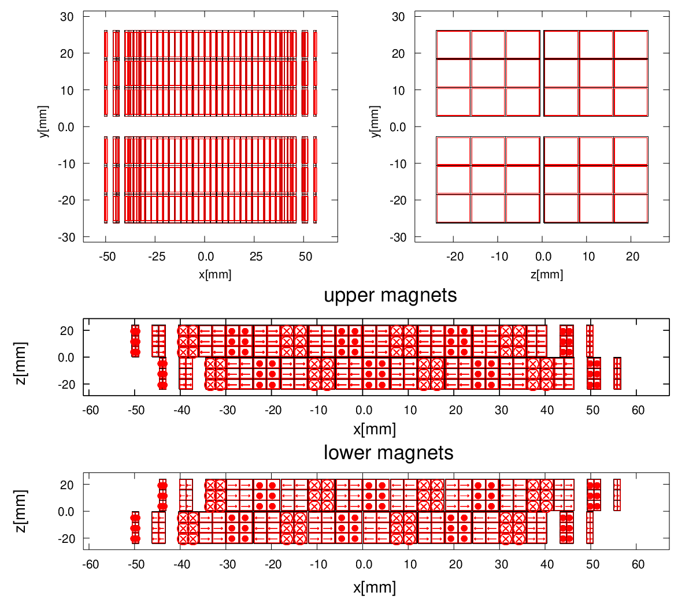

   A simple elliptical undulator in 0.25 shift state with end structures.

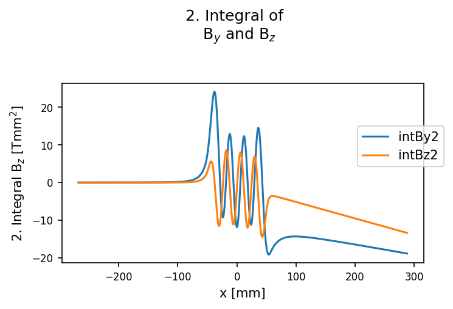

   Second field integrals. 
   
Saving and Loading Undulators
^^^^^^^^^^^^^^^^^^^^^^^^^^^^^^^^^^^^

| The geometry of an undulator object can also be saved in a yaml text format after construction and later be loaded. 

.. _codeblockUnduLoad:

.. code-block:: python
   :linenos:
   :lineno-start: 1

   yamlFile=Path('path/to/undu.yaml')
   undulator.writeToParameterFile(file=yamlFile)

   undulatorLoad=undulator.loadFromDict(
   	name='myUndu',
   	file=yamlFile,
   	gap=gap,
   	nperiods=nperiods,
   	shift=shift,
   	)   
   undu.set_magnet_objects(magn_objects=undulatorLoad)

   undu.run()

Undulator YAML Format
-------------------------------------

Planar Undulators
^^^^^^^^^^^^^^^^^^^^^^^^^^^^^^^^^^^^

| The yaml file format created when using the undulator.writeToParameterFile member function in the :ref:`code <codeblockUnduLoad>` shown above is not very human-readable. That is why a readable file format for easy definition of undulators was created and is presented here.

| The file is structured into different blocks. The required ones are: "general", "undulator" and "periodic_magnet". A planar type undulator is not able to shift and so not able to produce elliptically polarized light. It usually consists of two magnet beams separated by an adjustable gap. Here it also means that all elements are permanent magnets. A planar-hybrid undulator in contrast can contain ferromagnetic poles. This makes the end design much more challenging. Here we show an example for a simple planar undulator. For an elliptical undulator some parameter options differ from what is shown here.

.. note::
   You find more examples in the git-repository under "scripts/Undumag_Examples/UnduYAML"

.. _codeblockYAML1:

.. code-block:: yaml
   :linenos:
   :lineno-start: 1

   # =============================================================================
   # GENERAL PARAMETERS
   # =============================================================================
   general:
     origin: [0.0, 0.0, 0.0]              # Origin of the device in [X, Y, Z] coordinates
     coordinate_names: ['X', 'Y', 'Z']    # Coordinate system labels, X-horizontal, Y-vertical, Z-longitudinal - inconsequential until now
     symmetries: ['X','Y']                # Normal directions to symmetrie planes - geometry definitions are such that full undulator is only created after application of these symmetry operations

   # =============================================================================
   # UNDULATOR PARAMETERS
   # =============================================================================
   undulator:
     name: "u24"	
     type: "Planar"  # Undulator type: "APPLE" or "Planar-Hybrid" or 'Planar'
     accelerator: "BESSYII" # Name of the accelerator
     periods: 73            # Number of periods in the undulator
     minimum_gap: 5.5       # Minimum designed gap in mm
   #  shim_mp: 0.0           # Gap between magnets and poles in a row (Z) in mm
   #  shim_pm: 0.5           # Gap between poles and magnets in a row (Z) in mm
     shim_m: 0.0            # Shim Between Magnets
     period_length: 24.0    # Primary period length in mm
     magnetization_first_magnet: [0.0,0.0,-1.0] # the magnetization vector of first periodic magnet on lower beam

   # =============================================================================
   # Geometry Definitions
   # =============================================================================
   geometry_info_file: "u24_geometries.yaml" # the definition file for the geometries
   material_file_folder: ""	# if custom material files are used
   
   periodic_magnet: # name of the geometry definition in the geometry_info_file
     geometry: "periodic_magnet_geo"
     material_id: 'pm_rec' # "pm_rec" - permanent magnet material, "fm_vanadium_permendur" - ferromagnetic pole material
     remanence: 1.58  # Block remanence in T (1.21 * 1.344 for cryogenic grade)

| The symmetrie information in "general" can be used to switch on symmetries for the simulation with the undu module. The "shim" values allow to separate magnets and poles longitudinally. The magnetization vector is the magnetization for the first periodic magnet on the lower beam. The magnetization for the other objects is then extrapolated according to Halbach's insides. The upper beam magnetization sequence is determined by symmetry operations. 

| The "geometry_info_file" holds the file name of the geometry definitions used for the following magnetic elements. The next entries define the actual magnetic elements making up the undulator. The entry "periodic_magnet" holds the name of the geometry from the geometry-file to use. "material_id" is the material to use. If non-std materials are used, the folder in which their definition files lie has to be specified in a "material_file_folder" entry. The "remanence" field introduces the remanence of the magnetic block. It can also be a list, in this case the list is used cyclically to give the elements longitudinally - from up- to downstream - their remanence.

| The "u24_geometries.yaml" can be defined like so:

.. code-block:: yaml
   :linenos:
   :lineno-start: 1

   # =============================================================================
   # MAGNET/POLE SHAPE DEFINITIONS
   # =============================================================================
   periodic_magnet_geo:
     form_type: 'oneSidedClamps'  # types: 'square', 'oneSidedClamps', 'cpmuStdPole', 'twoSidedClamps_a/b'
     main_block_dimensions: [50.0, 35.0, 6]  # [width, height, thickness] in mm
     clamp_cutout: [5.0,12.3,6] # dimensions of clamps to be cut-out of full blocks, upper left corner if object viewed downstream in x-y plane
     chamf: 0.3 # chamfer in up- and down-stream direction
     fracs: [1,1]
     segms: [4,2,4]

| This file can hold multiple geometry definitions. Each definition is identified by it's name (as used in line in 31 in the :ref:`main definition <codeblockYAML1>` . The comes the "form_type" argument which defines the general form of the element. "square", well, is a square. "oneSidedClamps" means the upper right corner - viewed front on in downstream direction - is missing, the parameters of the clamp defined in "clamp_cutout". "twoSidedClamps_a/b" is missing the upper right and left corners (b) or the upper left and lower right corners (a). "cpmuStdPole" is a complicated geometry which is also available and uses more parameters in the geometry definition - see the git repository. "chamf" defines cutouts of the edges of the magnets in down- and upstream direction. "fracs" defines how much finer the segmentation becomes towards the axis of the machine and "segms" defines the segmentation of this object.

| An optional main field for the yaml :ref:`file <codeblockYAML1>` is the "period" field:

.. code-block:: yaml
   :linenos:
   :lineno-start: 1

   period: 
    sequence: ['periodic_magnet','shim_m','periodic_magnet','shim_m','periodic_magnet','shim_m','periodic_magnet','shim_m']

| In the "sequence" field you can define the actual period you want to use for the machine. The list can contain the names of objects you defined on the main level of this file or names of entries in the "undulator" block - like "shift_m/pm/mp" or plain numbers. If "period" is not defined, the assumed sequence is as shown above.

| Another optional block is the "end_struct" block:

.. code-block:: yaml
   :linenos:
   :lineno-start: 1

   end_struct: 
     type: 'standard' # depends on the undulator-type, or "user"
   # custom sequence (up- to downstream) defining the end structure, can contain element names or numbers - interpreted as distances in Z, 
   #  sequence_up: ['end_magnet_2','shim_mp','end_pole','shim_pm','end_magnet_1','shim_mp'] 
   #  sequence_down: ['shim_mp','periodic_pole','shim_pm','end_magnet_1','shim_mp','end_pole','shim_pm','end_magnet_2'] 

| Picking "standard" for type creates some standard up- and downstream sequence depending on the undulator type. For Apple undulators and plane undulators, the ends are constructed according to the "1/4,1/2,3/4" - rule defining the relative width of the 3 end magnets relative to the "periodic_magnet". If the undulator type is "planar-hybrid", the standard configuration is more complicated - involving 2 different kind of end magnets, an end pole and different separations between them. See the git repository for details. If you pick "user", you have to either define the "sequence" entry - a list like in the "period" block - defining the sequence of elements at both ends, in downstream order. You can also define "sequence_up" and "sequence_down" if you want separate arrangements on both ends.
      
Elliptical/Apple Undulators
^^^^^^^^^^^^^^^^^^^^^^^^^^^^^^^^^^^^

If the "type" field in the "undulator" block is set to "APPLE", a few fields are different:

.. code-block:: yaml
   :linenos:
   :lineno-start: 1

   # =============================================================================
   # UNDULATOR PARAMETERS
   # =============================================================================
   undulator:
     name: "UE30"
     type: "APPLE"                  # Undulator type: "Plain_APPLE" or "Compensated_APPLE"
     accelerator: "BESSYII"               # Name of the accelerator
     periods: 73                          # Number of periods in the undulator
     minimum_gap: 5.5                     # Minimum designed gap in mm
     shim_m: 0.102                            # Gap between magnets in a row in mm
     period_length: 30.0                  # Primary period length in mm
     magnetization_first_magnet: [0.0,0.0,-1.0] # the magnetization vector of first periodic magnet on lower beam
     row_slit: 0.792 
     keeper_slit: 0.258   # keeper slit for functional magnets, for cm's the slit is determined by the cm- and fm-keepers having the same z-length and their respective geometries
     dist_fm_cm: 16
     drop_cm: 0.05      
     compensation: False  # shall compensation magnets (cm) be added?

| First, a "row_slit" is available to simulate a horizontal separation between magnet rows. Also, a "keeper_slit" variable is introduced which is used in the "standard" period configuration. Each period consists of 4 magnets arranged into 2 pairs of 2 called keepers. Between them, there is the "keeper_slit" gap. "dist_fm_cm", "drop_cm" and "compensation" control the creation of force-compensation magnet rows around the actual device. This option is still somewhat experimental. See the repository.
      
| The standard "period" sequence, if the block is not defined, is: ['periodic_magnet',shim_m,'periodic_magnet',keeper_slit,'periodic_magnet',shim_m,'periodic_magnet',keeper_slit].

| Another optional block for the main file in "APPLE" type machines is "three_keeper":
      
.. code-block:: yaml
   :linenos:
   :lineno-start: 1

   three_keeper:
     sequence: ['periodic_magnet',0.0,'periodic_magnet',shim_m,'periodic_magnet']  

| If it is not given, the sequence shown above is used. The three_keeper object can be used in the definition of the sequence of the individual rows - which is another option in "APPLE" mode:

.. code-block:: yaml
   :linenos:
   :lineno-start: 1

   rows:
     ll:
       sequence: ['upstream_end','period','three_keeper','downstream_end']
     lr:
       sequence: ['upstream_end','three_keeper','period','downstream_end']
     ul:
       sequence: ['upstream_end','three_keeper','period','downstream_end']
     ur: 
       sequence: ['upstream_end','period','three_keeper','downstream_end']

| If the row definitions are not explicitly given, they are assumed to be: ['upstream_end','periodic','downstream_end']. It is enough to only give the sequence for the lower left row, 'll', the other rows are then constructed from symmetry operations if needed.
   
.. note::
   All the shape definitions given here define the magnets only in the lower left quadrant of the machine - as always if the system is viewed face on in downstream direction with the orbit down the origin. Internally all parts of the undulator are derived from some magnets defined wrt the lower left quadrant. The other parts of the undulator are - in the plane undulator case - produced by applying the appropriate symmetrie options given in the symmetry-field in the "general" block via the undu module to the simulation. See the example of a simulation run from a yaml file down below. Also in the elliptical case the magnets are defined in the lower left quadrant. However, because of the rows being in general non-symmetric wrt each other and shiftable, the fields cannot be derived by applying symmetry operations to the field of one quadrant. However, the explicit geometric definition of the rows for other quadrants can still be derived by applying symmetrie operations to some row explicitly constructed in the lower left quadrant. All magnetic objects in all quadrants are then used for the relaxations done by undumag to derive actual magnetic fields. 
   
Simulating YAML Files
^^^^^^^^^^^^^^^^^^^^^^^^^^^^^^^^^^^^

To actually load and simulate the yaml files just shown, do:

.. code-block:: python
   :linenos:
   :lineno-start: 1

   import unduwave as uw
   from unduwave import undu_list_loading

   res_folder=Path("my/res/folder")
   official_yaml_folder=Path("my/yaml/folder")
   official_yaml_file="myfile.yaml"

   gap=6
   shift=0.0
   nperiods=3

   undu = uw.undu(undu_mode='from_undu_magns')
   undu_prog_paras = undu._prog_paras
   undu_prog_paras.res_folder.set(res_folder)
   undu_prog_paras.plotGeometry.set(1)
   undu_prog_paras.center_magnet_struct.set(0)
   undu_prog_paras.nthreads.set(6)

   ule=undu_list_loading.undu_list_element(
   	listFile=official_yaml_file,
   	listFolder=official_yaml_folder,
   	)

   undulator=ule.constructUndulator(
   	gap=gap,
   	shift=shift,
   	center=None,
   	nperiods=nperiods,
   	)

   undu.set_magnet_objects(magn_objects=undulator)

   # it would be good practice to set the periodLength for simulations
   periodLength=undulator.get_period_length(name_hints=['ll']) 
   undu_prog_paras.periodLength.set(periodLength*1e-3)
   if 'X' in undulator._symmetries : 
   	undu_prog_paras.create_z_sym.set(1)
   if 'Y' in undulator._symmetries :
   	undu_prog_paras.create_y_sym.set(1)

   undu.run()

.. note::

   The definitions of the axes is different in the file format than in the undu implementation. This will be changed in the next version. Promissed! Aso the unit is [m] for the undu_prog_paras period length, but mm returned by get_period_length. This will also be fixed soon. Proomisse.
   
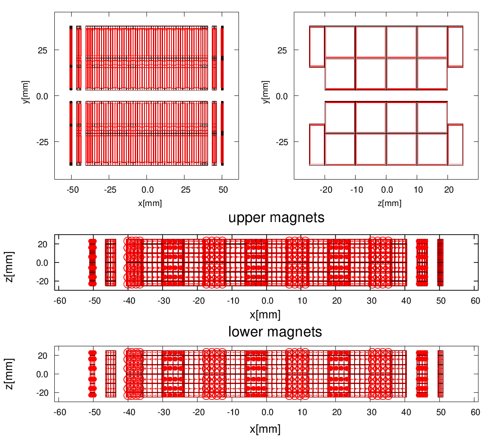

   The ue24 constructed via yaml files from above.

Plotting and Results
=====================

Options and Examples
--------------------------

| After a successful simulation, get the results from the undu or wave module by doing

.. code-block:: python
   
   results = wave.get_results() # Return Result Object

| From the results object we can get the quantities wich were calculated. 

.. code-block:: python
   
   quant = results.get_result(which=string_identifier)
   
| The data can be retrieved from the quan object vie quant._data - this gives a list of values holding the results. For multi-dimensional results like flux densities, the result is a tensor of shape (ny,nz) reshaped to one of shape(ny*nz). 

| Here are some plotting examples with wave:

.. code-block:: python
   :linenos:
   :lineno-start: 1

   results = wave.get_results()

   traj_x = results.get_result(which='traj_x')
   traj_y = results.get_result(which='traj_y')
   traj_z = results.get_result(which='traj_z')

   traj_y.plot_over(x_quant=traj_x,nfig=nfig,nosave=True)
   nfig=traj_z.plot_over(x_quant=traj_x,nfig=nfig)

   nfig=traj_y.plot_over(x_quant=traj_z,nfig=nfig)

   By = results.get_result(which='By')
   By.plot_over(x_quant=traj_x,nfig=nfig,nosave=True)
   Bz = results.get_result(which='Bz')
   nfig=Bz.plot_over(x_quant=traj_x,nfig=nfig)

   power_z = results.get_result(which='power_z')
   power_y = results.get_result(which='power_y')
   power_distro = results.get_result(which='power_distribution')
   nfig=power_distro.plot_over_3d(x_quant=power_z,y_quant=power_y,file_name=None,nosave=False,nfig=nfig)

   en_flux = results.get_result(which='en_flux')
   flux = results.get_result(which='flux')
   nfig=flux.plot_over(x_quant=en_flux,file_name=None,nosave=False,nfig=nfig,loglog=False)

   en_brill = results.get_result(which='en_brill')
   brill0 = results.get_result(which='brill0')
   brill0e = results.get_result(which='brill0e')
   brill0f = results.get_result(which='brill0f')
   brill0ef = results.get_result(which='brill0ef')
   brill0.plot_over(x_quant=en_brill,nfig=nfig,nosave=True,loglog=False)
   brill0e.plot_over(x_quant=en_brill,nfig=nfig,nosave=True,loglog=False)
   brill0f.plot_over(x_quant=en_brill,nfig=nfig,nosave=True,loglog=False)
   nfig=brill0ef.plot_over(x_quant=en_brill,nfig=nfig,loglog=False)

   en_fd = results.get_result(which='en_fd')
   flux_density_onaxis = results.get_result(which='flux_density')
   nfig=flux_density_onaxis.plot_over(x_quant=en_fd,nfig=nfig,loglog=False)

   flux_dens_distr_ens_loaded = results.find_load_flux_density_distribution(energies=[500])
   fd_y = results.get_result(which='fd_y')
   fd_z = results.get_result(which='fd_z')
   for en in flux_dens_distr_ens_loaded :
   	fd = results.get_result(which=f'flux_density_distribution_{en:.2f}')
   	nfig=fd.plot_over_3d(x_quant=fd_z,y_quant=fd_y,file_name=None,nosave=False,nfig=nfig)

| traj_x, traj_y, traj_z - The x,y,z values of the trajectory.

| By, Bz - y and z components of B

| power_y, power_z, power_distribution - The y and z coordinates for the power distribution on the screen and the values of the actual power distribution

| en_flux, flux - the energy values at which the flux through the pinhole was calculated and the flux itself

| en_brill, brill0, brill0e, brill0f, brill0ef - The energy values at which the Brilliance was calculated and the brilliance. brill0 - no energy spread and no emittance, brill0e - brilliance with energy spread, brill0f - brilliance with emittance folding, brill0ef - brilliance with energy spread and emittance.

| en_fd, flux_density - Energy at which flux density on axis is calculated and flux density on axis

| fd_y, fd_z, flux_density_distribution_{en} - the y and z coordinates of a given flux-density distribution (they are the same for all energies, so one pair suffices) and the actual flux density distribution - which contains the energy rounded to second decimal place. So, for example, at the energy 460 eV, the name would be: flux_density_distribution_460.00

| And for the undu module:

.. code-block:: python
   :linenos:
   :lineno-start: 1

   undu.run()
   results = undu.get_results(add=add)

   trajx = results.get_result(which='trajx')
   by = results.get_result(which='by')
   bz = results.get_result(which='bz')
   intBy = results.get_result(which='intBy')
   intBz = results.get_result(which='intBz')
   intBy2 = results.get_result(which='intBy2')
   intBz2 = results.get_result(which='intBz2')

   zProfile = results.get_result(which='profz')
   ByProfile = results.get_result(which='profBy')
   BzProfile = results.get_result(which='profBz')

   bmap = results.get_result(which='bmap')

   nfig=0
   by.plot_over(
   	x_quant=trajx,
   	nfig=nfig,
   	nosave=True,
   	clear=True,
   	)
   nfig=bz.plot_over(
   	x_quant=trajx,
   	nfig=nfig,
   	plot=True,
   	title=f'B$_y$ and B$_z$',
   	)

   intBy.plot_over(
   	x_quant=trajx,
   	nfig=nfig,
   	nosave=True,
   	clear=True,
   	)
   nfig=intBz.plot_over(
   	x_quant=trajx,
   	nfig=nfig,
   	plot=False,
   	title=f'1. Integral of \n B$_y$ and B$_z$',
   	)

   intBy2.plot_over(
   	x_quant=trajx,
   	nfig=nfig,
   	nosave=True,
   	clear=True,
   	)
   nfig=intBz2.plot_over(
   	x_quant=trajx,
   	nfig=nfig,
   	plot=False,
   	title=f'2. Integral of \n B$_y$ and B$_z$',
   	)

   ByProfile.plot_over(
   	x_quant=zProfile,
   	nfig=nfig,
   	nosave=True,
   	clear=True,
   	)
   nfig=BzProfile.plot_over(
   	x_quant=zProfile,
   	nfig=nfig,
   	plot=False,
   	title=f'Profile of B$_y$ and B$_z$',
   	)
   	
| trajx is the x-coordinate for the magnetic field values by,bz and magnetic field integrals quantities intBy/z and intBy/z2. profz, profBy/z give a magnetic field profile in the center of the machine. 

| Note that the bmap object is actually a bfield class instance. How to handle and plot this was covered in :ref:`ch-kicksngrids`.

Plotting 2D Results
--------------------------

Each quantities data is saved under quantity._data. Each quantity has a number of plotting routines. To do a simple 2D plot, you can do:

.. code-block:: python
   :linenos:
   
   results = wave.get_results() # Return Result Object
   traj_x = results.get_result(which='traj_x')
   By = results.get_result(which='By')
   By.plot_over(x_quant=traj_x)

This plots the y-component of the B-field over the x-coordinate. 

Merge Plots
--------------------------

To plot y and z components together, do:

.. code-block:: python
   :linenos:
   
   nfig=0 # telling it to start with figure number 0
   results = wave.get_results() # Return Result Object
   traj_x = results.get_result(which='traj_x')
   By = results.get_result(which='By')
   By.plot_over(x_quant=traj_x,nfig=nfig,nosave=True)
   Bz = results.get_result(which='Bz')
   nfig=Bz.plot_over(x_quant=traj_x,nfig=nfig,title='B-Field')
   
This will plot By and Bz into the same window, setting a title and returning the new nfig number which can be used in the next plotting command as an argument.

Log Plots
--------------------------

To plot logarithmic axes, do:

.. code-block:: python
   :linenos:
   
   nfig=0 # telling it to start with figure number 0
   results = wave.get_results() # Return Result Object
   en_flux = results.get_result(which='en_flux')
   flux = results.get_result(which='flux')
   nfig=flux.plot_over(x_quant=en_flux,file_name=None,nosave=False,nfig=nfig,loglog=True)   

Parametric Plots
--------------------------

To do parametric plots, do:

.. code-block:: python
   :linenos:
   
   nfig=0 # telling it to start with figure number 0
   results = wave.get_results() # Return Result Object
   traj_x = results.get_result(which='traj_x')
   traj_y = results.get_result(which='traj_y')
   traj_z = results.get_result(which='traj_z')

   traj_y.plot_over(x_quant=traj_x,nfig=nfig,nosave=True)
   nfig=traj_z.plot_over(x_quant=traj_x,nfig=nfig,title='Trajectory')
   nfig=traj_z.plot_parametric_3d(x_quant=traj_x,y_quant=traj_y,title='Trajectory',nfig=nfig)

3D Plots
--------------------------

To do 3D plots, do:

.. code-block:: python
   :linenos:
   
   nfig=0 # telling it to start with figure number 0
   results = wave.get_results() # Return Result Object
   power_z = results.get_result(which='power_z')
   power_y = results.get_result(which='power_y')
   power_distro = results.get_result(which='power_distribution')
   nfig=power_distro.plot_over_3d(x_quant=power_y,y_quant=power_z,file_name=None,nosave=False,nfig=nfig)

Each call to plot_over_3d creates a 3D plot, a heat plot and plots of interpolated data. 

| Here are some plotting examples:

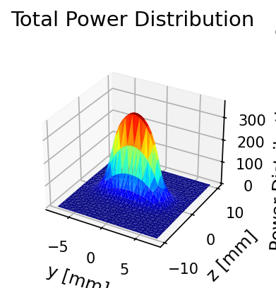

   Original 3D-plot of a power distribution.

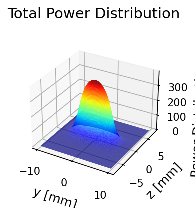

   Interpolated 3D-plot of the previous power distribution.

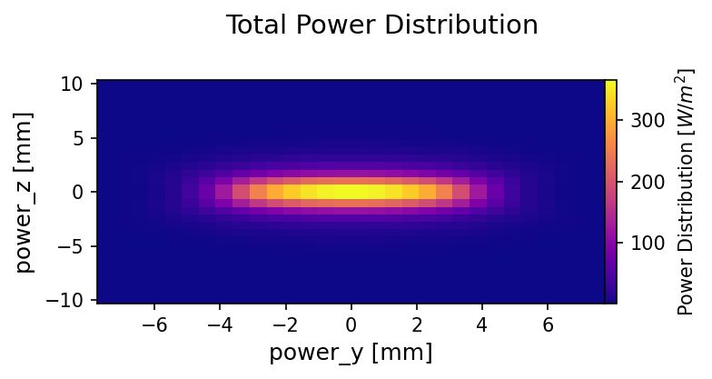

   Original heat map of the above power distribution.

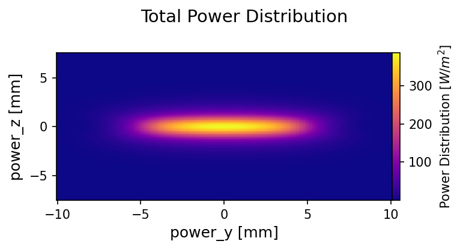

   Interpolated heat map of the above power distribution.

Plot Flux Density Distributions
--------------------------

To plot the flux density distribution, you have to specify the energy at which you want to do this. 

.. code-block:: python
   :linenos:
   
   nfig=0 # telling it to start with figure number 0
   results = wave.get_results() # Return Result Object
   flux_dens_distr_ens_loaded = results.find_load_flux_density_distribution(energies=[460,504])
   for en in flux_dens_distr_ens_loaded :
   	fd = results.get_result(which=f'flux_density_distribution_{en:.2f}')
   	nfig=fd.plot_over_3d(x_quant=fd_y,y_quant=fd_z,file_name=None,nosave=False,nfig=nfig)

The call to find_load_flux_density_distribution searches for the closest distribution files to the energies specified and returns the corresponding energies it found as a list. From this returned list, the corresponding flux_densitie quantities can be returned and then plotted.

